# SUPER MARIO PLUS

## Software Design Report — Object-Oriented Design, Design Patterns and System Architecture

**Course:** CS202 – Programming Systems · **Class:** 25A01 · **Group:** 51
University of Science – VNUHCM · Faculty of Information Technology · September 2026

| Student ID | Full name |
|---|---|
| 25125028 | Phạm Đức Minh |
| 25125007 | Lê Tiến Bình |

> **Companion document.** This report explains *how the game is built*. The complete inventory of
> **99 features**, each with its mechanism and its source files, is in
> `SuperMarioPlus_Feature_Catalog.md`. The four *architectural highlights* named in §1.5 below are
> engineering themes, **not** the feature list.

---

## Table of contents

| § | Section |
|---|---|
| **1** | **The game** — genre, story, how it is played, how it is finished, highlights |
| **2** | **The game's features** — the three modes, the editor, characters, enemies, bosses, worlds |
| **3** | **The group** — members, division of work, how we worked |
| **4** | **Object-oriented design** — the rules we held ourselves to, and the class hierarchies |
| **5** | **Design patterns and the reasoning behind them** — every pattern applied, and four rejected |
| **6** | **Code organisation** — what every group of `.h` / `.cpp` files is responsible for |
| **7** | **The four-phase game loop** — HandleInput, Process, Update, Render, each traced end to end |
| **8** | **Key technical mechanisms** — LDtk↔JSON↔C++, collision, combat, skills, items, save, editor |
| **9** | **Design decision matrix** |
| **10** | **Build and reproduction** |
| **11** | **Diagram index** |
| **12** | **Conclusion** |
| **13** | **Source evidence index** |

**43 diagrams** are embedded in this document as Mermaid source. They render directly on GitHub and in
VS Code with no extension. The same architecture is also available as PlantUML in
`workflow/blueprints/`.

---
---

# 1. The game

## 1.1 Genre and premise

**Super Mario Plus** is a **2D side-scrolling action platformer** with a story campaign, built in
C++17 on the raylib graphics library. It takes the movement vocabulary of a classic platformer — run,
jump, crouch, climb, swim, ride springs, break blocks — and layers an action game on top of it: a
four-hit melee combo chain, ranged and special attacks, a dash, a guard, a mana economy, timed
power-ups, and boss fights.

It is a **crossover**. The playable roster is drawn from several anime worlds — Goku, Naruto, Luffy,
Kakashi, Sasuke and Zoro — and so are the antagonists. That is not decoration; it is the premise the
campaign is built on.

## 1.2 The story

A group of villains has scattered across six separate worlds. No single hero can be in six places at
once, so the heroes **split up** — each takes one world alone, fights through it, and confronts the
villain waiting at the end of it.

That premise is what gives the game its shape. Each world is a self-contained chapter with its own
terrain, its own enemies and its own boss. The player picks which world to enter and which hero to
send into it, and each world keeps its **own independent save history**, because each is a separate
mission rather than a stage in one linear sequence.

The second player fits the same fiction two ways: **co-op**, where two heroes take a world together,
and **versus**, where two heroes settle a disagreement in an arena.

## 1.3 How you play

The player controls one hero on a keyboard. Two players share one keyboard, each with their own
independent key map — every action listed below can be rebound separately for player 1 and player 2.

| Action | What it does |
|---|---|
| Move left / right | Run, at a speed defined per character |
| Jump | Rise and fall as separate behaviours, with per-character jump strength |
| Crouch | Shrink the hitbox to fit low gaps; crouch + jump drops through one-way platforms |
| Climb | Move up and down ladders and vines, and hang in place |
| Attack | Chain up to four melee attacks; a different attack in the air and from a crouch |
| Long attack | Fire the character's own projectile |
| Special | A stronger, costlier signature attack |
| Dash | A burst of movement |
| Block | Take a defensive stance that subtracts from incoming damage |
| Use item | Consume or throw whatever is held |
| Interact | Open chests, use doors, enter the shop |

Swimming replaces normal movement in water, and a breath meter starts draining. Health, mana, breath,
coins, keys and the currently held item are all shown on the HUD.

## 1.4 How you finish a world

A world is a graph of connected rooms — the largest, world 6, has 24 of them. Walking off the edge of
a room loads the neighbouring one with no loading screen.

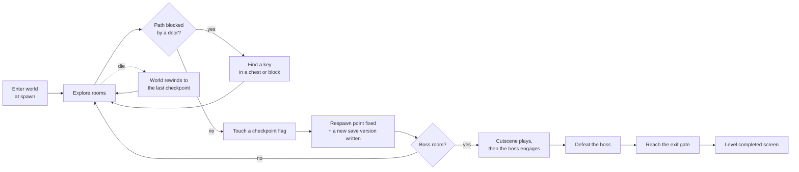

*Diagram 1 — Finishing a world.*

Progress is secured **only** at checkpoint flags, and touching one writes a permanent, separately
numbered save. Dying rewinds the world — not just the player — to the state it was in at that
checkpoint: enemies defeated afterwards are alive again, chests opened afterwards are shut again.

## 1.5 Architectural highlights

Four engineering decisions shape the whole project. They are **themes, not features** — the 99
features they support are catalogued separately.

**① The game is driven by data, not by code.** Six characters, nine enemy types, six bosses, their
statistics, animations, skills, projectiles and explosions are all declarations in JSON. There is one
`Player` class and one `Mob` class. Adding a character is an edit to `characters.json`.

**② Behaviour is modelled as states, not as flags.** Ten player behaviours, seven enemy behaviours
and nine boss behaviours are each an object with its own transitions. This is why a cancelled attack
structurally cannot keep dealing damage, and why a boss cannot attack during its own intro cutscene.

**③ Saving is a four-layer stack, and saves are versioned.** Data structures, serialiser, repository
and facade are separate and injected, and every checkpoint writes a new version rather than
overwriting — so a player keeps the history of a run.

**④ The level editor produces real levels.** `TileMap` has two loading entry points — the LDtk
campaign format and the editor's own format — that build the *same* internal model. Everything
downstream is identical, which is why a hand-built map has working bosses, checkpoints and combat
rather than being a preview.

---
---

# 2. The game's features

This section describes what the game contains. The exhaustive list with mechanisms and file
references is in the companion feature catalogue; what follows is the shape of it.

## 2.1 Single-player story mode

The main campaign. The player chooses a world from a map screen, chooses whether to begin a new run
or resume a saved one, chooses a hero, and plays that world's rooms through to its exit gate.

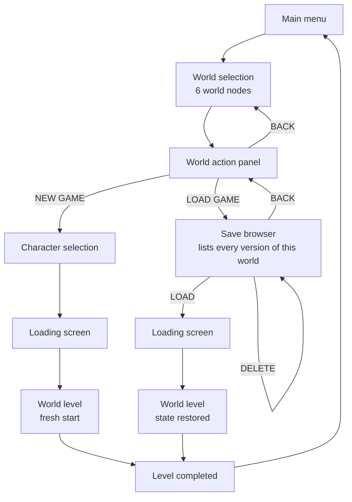

*Diagram 2 — The single-player route, from menu to completion.*

## 2.2 Two-player co-operative mode

Two players take a world together on one keyboard. They have **independent** controls, health, mana,
breath and held item, and a **shared** camera that keeps both in frame plus a **pooled** inventory —
coins and keys found by either benefit both. An enemy targets whichever player is nearer and alive.

Co-op is not a parallel implementation. The level holds an optional second player and the systems
below it were written against *a* player rather than *the* player, so physics, combat, items and
saving are unchanged.

## 2.3 Player-versus-player mode

Six dedicated arenas in which the two players fight each other, ending in a winner's podium showing
the victorious character animating in the centre of the frame.

The entire mode cost **one bitmask**. Damage permission is expressed as a faction mask on each
hitbox rather than as a type test in the combat system, so an arena simply builds each player's
hitboxes with a mask that includes the other player's faction. Damage, defence, knockback, hit-stop
and invincibility frames all apply unchanged.

## 2.4 Custom maps and the level editor

A complete level editor is built into the game. It has a pannable, zoomable grid canvas, a
categorised block palette drawn from five worlds' tilesets, an entity palette carrying every item
type plus **all nine enemies and all six bosses**, rule-based auto-tiling that picks the correct edge
and corner artwork automatically, fifty-step undo and redo, drag-to-resize handles on all four edges,
JSON save and load to numbered slots, and one-key test play.

## 2.5 The playable characters

Six heroes, each with distinct statistics and a complete animation set. They genuinely play
differently: Luffy is a durable, slow bruiser; Kakashi is fragile and fast.

| Character | Health | Mana | Move speed | Jump strength | Animations |
|---|---|---|---|---|---|
| Goku | 300 | 100 | 300 | −600 | 17 |
| Naruto | 280 | 120 | 320 | −580 | 17 |
| Luffy | 350 | 80 | 280 | −620 | 17 |
| Kakashi | 260 | 130 | 310 | −590 | 17 |
| Sasuke | 270 | 110 | 330 | −600 | 21 |
| Zoro | 320 | 90 | 290 | −580 | 17 |

Every hero has the same **thirteen skills** — four combo attacks, a jump attack, a low attack, a long
attack, a special, a dash and a block — but each one's damage, reach, timing, projectile artwork and
explosion radius are that character's own.

## 2.6 The enemies

Nine types, differentiated by data rather than by class. Detection range decides how alert they are;
attack range decides whether they close in or strike from a distance.

| Enemy | Health | Speed | Detection | Attack range | Character |
|---|---|---|---|---|---|
| Rat | 30 | 120 | 300 | 35 | Fast, fragile swarm |
| Bat | 35 | 150 | 350 | 50 | Fastest mover |
| Goblin | 40 | 110 | 300 | 40 | Standard melee |
| Slime | 45 | 50 | 200 | 35 | Slow, short-sighted |
| Mushroom | 50 | 100 | 100 | 40 | Only notices you up close |
| Skeleton | 60 | 90 | 250 | 45 | Durable melee |
| Soldier | 80 | 90 | 350 | 150 | Ranged; attacks from distance |
| Tree | 100 | 60 | 200 | 50 | Slow, high health |
| Guardian | 200 | 70 | 400 | 60 | Sees furthest, hardest to kill |

## 2.7 The bosses

Six set-piece encounters — **Doflam, Franky, Itachi, Sasuke, Shank** and **Naruto** — each with 1000
health, a 500-pixel detection range and a full move set. Each is gated behind a cutscene: the boss
holds its entrance pose and *cannot* transition into combat until the cutscene has finished, so the
fight never starts underneath the dialogue.

## 2.8 Worlds and levels

| World | Map file | Rooms | Character of the world |
|---|---|---|---|
| 1 | `assets/maps/map01/world01.ldtk` | 1 | Opening area |
| 2 | `assets/maps/map02/world02.ldtk` | 1 | Auto-layer terrain showcase |
| 3 | `assets/maps/map03/world03.ldtk` | 11 | Vertical: a top and bottom half connected by shafts |
| 4 | `assets/maps/map04/world04.ldtk` | 19 | Caves and water — secret passages, coves, pits |
| 5 | `assets/maps/map05/world05.ldtk` | 7 | Sloped terrain |
| 6 | `assets/maps/map06/world06.ldtk` | 24 | The largest: sewers, ossuary, gardens, a shop, a boss room |
| | **Total** | **63 rooms** | Plus 6 PvP arenas |

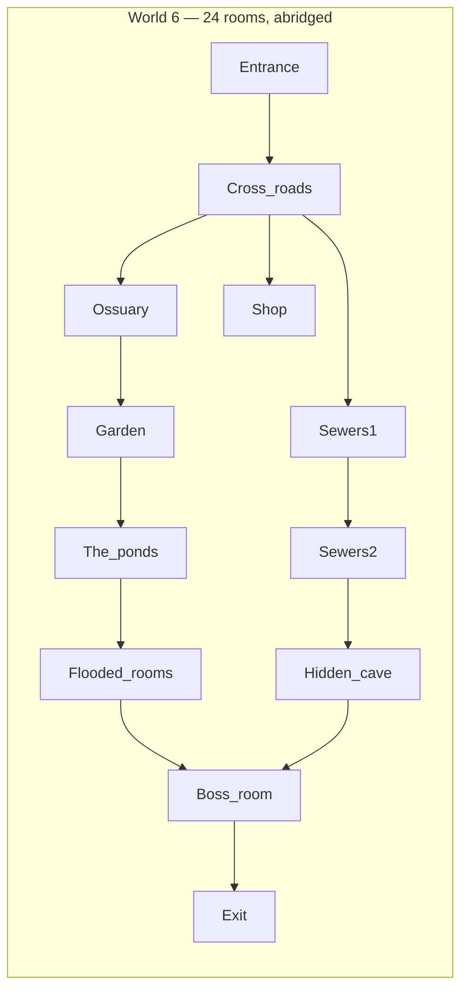

*Diagram 3 — A world is a graph of rooms, not a linear sequence. Neighbour links come from LDtk's own
world grid.*

## 2.9 The full feature list

Ninety-nine features are catalogued individually in `SuperMarioPlus_Feature_Catalog.md`, grouped into
seventeen categories, each with a description of the mechanism and the source files that implement it.

---
---

# 3. The group

## 3.1 Members

| Student ID | Full name | Git author | Commits |
|---|---|---|---|
| 25125028 | Phạm Đức Minh | `Pham Duc Minh` | 30 |
| 25125007 | Lê Tiến Bình | `ltbinh812` | 38 |

68 commits across 11 branches, from 8 June 2026 to 1 September 2026.

## 3.2 Division of work

We split the project by **subsystem**, not by file, so that each of us owned a coherent area and
could design within it without waiting on the other.

| Member | Owned subsystems |
|---|---|
| **Phạm Đức Minh** | Player state machine · animation system · skills, combo chain and mana · `CombatSystem` and hitbox resolution · `Fireball` and `Explosion` · the nine enemy types and six bosses · enemy and boss AI state machines · cutscenes and cinematic camera |
| **Lê Tiến Bình** | LDtk loading and `TileMap` · the collision grid and physics resolution · `MapCamera` · the item system · the whole UI layer · the shop · the map editor · the save system · endgame · every branch merge |

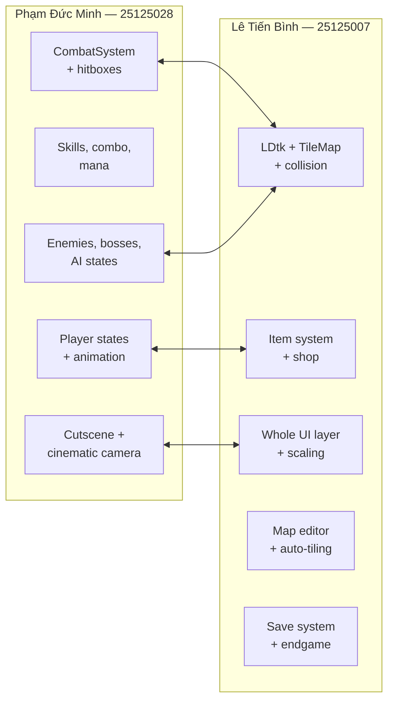

*Diagram 4 — Subsystem ownership and the seams where the two halves meet.*

The arrows are the interesting part: they are the places where the two halves had to agree on an
interface. `Entity`'s physics contract, the `Hitbox` struct, the spawn queue and `IMenuPanel` were all
negotiated at those seams, and each of them became a place where a pattern was worth applying — see
§5.

## 3.3 How we worked

Eleven branches, one per feature area, merged into `main`. Each member's commits stay inside their own
subsystem, which is what makes the seams above visible in the history rather than hidden in merge
conflicts. Where a change had to cross a seam — enabling PvP, adding the spawn queue — we agreed the
interface first and each implemented our own side of it.

Three self-imposed rules governed the code:

1. **One class, one file.** 328 source files, no exceptions.
2. **The four-phase rule.** Input, decision, mutation and drawing never interleave; `Render` is
   `const`.
3. **Patterns must earn their place.** A pattern is applied when it removes a real problem, and named
   accurately when it is — §5.13 lists the four we deliberately did *not* use.

---
---

# 4. Object-oriented design

This section is about the rules the codebase holds itself to. §5 is about the patterns built on top
of them.

## 4.1 One class, one file

Every class lives in its own header, and every non-trivial class has its own implementation file.
There are 192 headers and 136 implementation files. The rule costs a lot of files; it buys three
things that mattered constantly on a two-person project: a class's location is derivable from its
name, two people editing different classes never touch the same file, and the dependency graph is
visible in the `#include` lines rather than hidden inside a large translation unit.

## 4.2 Encapsulation, and "Tell, Don't Ask"

State is private, and — more importantly — objects are asked to *do* things rather than to hand over
their internals so the caller can do it for them.

`Player` is the clearest example. It exposes movement helpers such as `startMovingLeft()`,
`applyJumpImpulse()`, `enterWater()` and `stopCrouching()`, and its state classes call those. What the
states do **not** do is fetch a mutable reference to the player's runtime statistics and write to it
directly. The header says so in a comment: *"Movement helpers (called by States — Tell, Don't Ask)"*,
and a second group of helpers exists specifically to keep the swim and climb states from needing
`getRuntimeStatsMutable()`.

The consequence is concrete. Because velocity is only ever changed through a named method, every
change to velocity is greppable, and a state cannot corrupt a field it was not meant to touch.

## 4.3 Abstraction — the interfaces

Nine abstract interfaces define the extension points of the whole system. Each exists because
something genuinely needed to vary.

| Interface | Contract | Implementations | What varies |
|---|---|---|---|
| `IEntityState<T>` | `onEnter` · `onExit` · `update` · `canExit` · input hooks | 10 (via `PlayerState`) | How a player behaves |
| `IMobState` | `enter` · `decideAction` · `process` · `exit` · `onHitWall` | 16 (7 enemy + 9 boss) | How an enemy behaves |
| `ISkill` | `execute(Player&)` + timing and combat data | 10 | What an attack does |
| `IEnemySkill` | Enemy attack execution | 3 | How an enemy attacks |
| `IBuffEffect` | Multiplier and capability queries · `onApply` · `onRemove` · `render` | 9 | What a power-up grants |
| `IItemUseStrategy` | `use(Player&)` | 3 | What "use the held item" means |
| `IEditorTool` | `onPress` · `onDrag` · `renderGhost` | 3 | What a click in the editor does |
| `ICameraMode` | `update` · `isFinished` · `getName` | 3 | How the camera moves |
| `ICollisionDetector` | `detect(hitboxes, entities)` | 1 | How hit detection is performed |
| `ISaveSerializer` | `serialize` · `deserialize` | 1 | The on-disk save format |
| `ISaveRepository` | `save` · `load` · `list` · `remove` | 1 | Where saves are stored |
| `IGameCommand` | `Execute(StateManager&)` | 3 | What a screen transition is |
| `IPlayerCommand` | `Execute(Player&)` | 13 | What a key press means |
| `IMenuPanel` | `Update` · `Render` · `HandleInput` · entry/exit | 4 | What a menu panel is |
| `ITransition` | `Start` · `Update` · `Render` · `IsFinished` | 1 | How screens wipe |
| `IEffect` | Status effect contract | 2 | What a damage-over-time does |

```mermaid
classDiagram
    class IEntityState~T~ {
        <<interface>>
        +onEnter()* void
        +onExit()* void
        +update(float dt)* void
        +canExit() bool
        +onMoveLeft() void
        +onJump() void
        +onAttack() void
    }
    class IMobState {
        <<interface>>
        +enter(Mob&)* void
        +decideAction(Mob&)* void
        +process(Mob&)* void
        +exit(Mob&)* void
        +onHitWall(Mob&, bool, bool) void
    }
    class ISkill {
        <<abstract>>
        #manaCost float
        #hitboxStartTime float
        #hitboxEndTime float
        #nextComboSkillName string
        +execute(Player&)* void
        +hasNextCombo() bool
    }
    class IBuffEffect {
        <<interface>>
        +getName()* string
        +getSpeedMultiplier() float
        +isInvincible() bool
        +onApply(Player&) void
    }
    class IItemUseStrategy {
        <<interface>>
        +use(Player&)* void
    }
    class ICameraMode {
        <<interface>>
        +update(MapCamera&, float)* void
        +isFinished()* bool
    }
    class IEditorTool {
        <<interface>>
        +onPress(int, int, CustomMapData&)* bool
        +onDrag(int, int, CustomMapData&)* bool
        +renderGhost(int, int, Rectangle, CustomMapData&)* void
    }
    class ISaveRepository {
        <<interface>>
        +save(GameSaveData&)* bool
        +load(SaveSlotInfo&)* GameSaveData
        +list(int world)* vector~SaveSlotInfo~
    }
    class IGameCommand {
        <<interface>>
        +Execute(StateManager&)* void
    }
    class IPlayerCommand {
        <<interface>>
        +Execute(Player&)* void
    }
```

*Diagram 5 — The extension points. Every one of these exists because a concrete thing needed to vary
at runtime; none was added speculatively.*

## 4.4 Inheritance

Inheritance is used where there is a genuine *is-a* relationship and a shared implementation worth
inheriting. Where the relationship is *has-a*, composition is used instead (§4.6).

### The entity tree

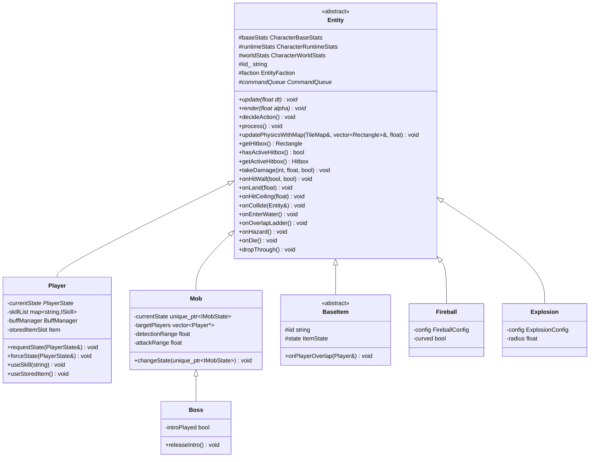

*Diagram 6 — The `Entity` hierarchy. Five direct children; only one second-level descendant.*

`Entity` splits its data into **three** structs rather than one bag of fields, and the split is
meaningful: `CharacterBaseStats` is the immutable configuration loaded from JSON (maximum health,
base speed, jump strength), `CharacterRuntimeStats` is the mutable simulation state (current health,
current mana, velocity, facing), and `CharacterWorldStats` is the spatial state (position, start
position, hitbox). Const accessors are public; the mutable accessors exist but are used only through
the player's named helpers (§4.2). It also carries the two fields that make the rest of the
architecture work: `iid_`, the stable identifier from LDtk that makes world state saveable, and
`faction`, the value the combat system filters on.

The tree is deliberately **shallow**. `Boss` is the only class two levels below `Entity`, and it
inherits from `Mob` because a boss genuinely *is* an enemy with more states — it reuses the targeting,
the physics, the animation and the combat integration, and adds an intro gate and nine states instead
of seven.

### The item tree

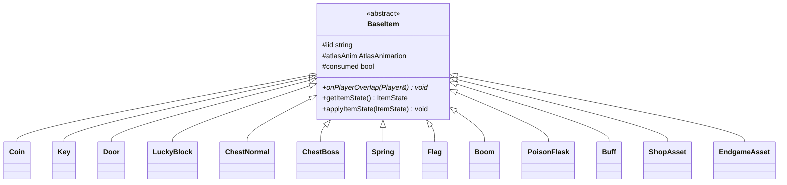

*Diagram 7 — Thirteen item types over one base. Every one is also an `Entity`, so every one collides,
animates and can be saved by the same code.*

### The screen tree

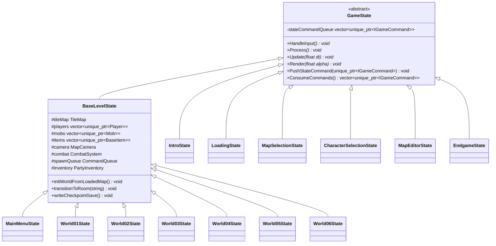

*Diagram 8 — The screen hierarchy. Note that `MainMenuState` inherits `BaseLevelState`: the main
menu **is** a running level, which is why real characters can fight behind the buttons.*

`BaseLevelState` is where inheritance pays for itself. Everything a level does — build the world from
a map, run the four phases over every entity, transition between rooms, checkpoint, respawn, drive the
camera and the HUD — lives once. The six world classes carry only what is genuinely per-world.

### The behaviour trees

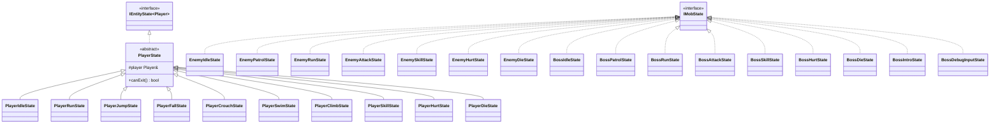

*Diagram 9 — Twenty-six behaviour classes over two interfaces.*

`IEntityState<T>` is a **template interface**, parameterised on the entity it drives. `PlayerState`
instantiates it as `IEntityState<Player>`, which gives the player's states a compile-time-typed
reference to their owner with no downcast. This is static polymorphism and dynamic polymorphism used
together, each where it fits: the *type* is fixed at compile time, the *behaviour* varies at runtime.

### The interface-implementation trees

```mermaid
classDiagram
    class ISkill {
        <<abstract>>
    }
    ISkill <|-- Attack1Skill
    ISkill <|-- Attack2Skill
    ISkill <|-- Attack3Skill
    ISkill <|-- Attack4Skill
    ISkill <|-- JumpAttackSkill
    ISkill <|-- LowAttackSkill
    ISkill <|-- LongAttackSkill
    ISkill <|-- SpecialSkillAttack
    ISkill <|-- DashSkill
    ISkill <|-- BlockSkill

    class IEnemySkill {
        <<interface>>
    }
    IEnemySkill <|.. BasicMeleeEnemySkill
    IEnemySkill <|.. ProjectileEnemySkill
    IEnemySkill <|.. ExplosionEnemySkill

    class IBuffEffect {
        <<interface>>
    }
    IBuffEffect <|.. SpeedBuff
    IBuffEffect <|.. JumpBuff
    IBuffEffect <|.. StrengthBuff
    IBuffEffect <|.. ShieldBuff
    IBuffEffect <|.. HealBuff
    IBuffEffect <|.. InvisiBuff
    IBuffEffect <|.. GoldMagnetBuff
    IBuffEffect <|.. TimeStopBuff
    IBuffEffect <|.. RandomBuff

    class IItemUseStrategy {
        <<interface>>
    }
    IItemUseStrategy <|.. ConsumeBuffStrategy
    IItemUseStrategy <|.. ThrowBombStrategy
    IItemUseStrategy <|.. ThrowPoisonStrategy
```

*Diagram 10 — Skills, enemy skills, buffs and item-use behaviours.*

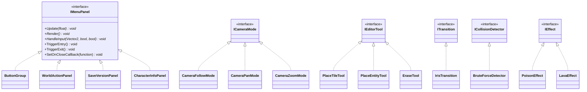

*Diagram 11 — Panels, camera modes, editor tools, transitions, detectors and status effects.*

```mermaid
classDiagram
    class IGameCommand {
        <<interface>>
        +Execute(StateManager&)* void
    }
    IGameCommand <|.. PushStateCommand
    IGameCommand <|.. PopStateCommand
    IGameCommand <|.. ChangeStateCommand

    class IPlayerCommand {
        <<interface>>
        +Execute(Player&)* void
    }
    IPlayerCommand <|.. MoveLeftCommand
    IPlayerCommand <|.. MoveRightCommand
    IPlayerCommand <|.. StopLeftCommand
    IPlayerCommand <|.. StopRightCommand
    IPlayerCommand <|.. JumpCommand
    IPlayerCommand <|.. CrouchCommand
    IPlayerCommand <|.. StopCrouchCommand
    IPlayerCommand <|.. ClimbCommand
    IPlayerCommand <|.. AttackCommand
    IPlayerCommand <|.. UseSkillCommand
    IPlayerCommand <|.. InteractCommand
    IPlayerCommand <|.. DropThroughCommand

    class ISaveRepository {
        <<interface>>
    }
    ISaveRepository <|.. FileSaveRepository
    class ISaveSerializer {
        <<interface>>
    }
    ISaveSerializer <|.. JsonSaveSerializer
```

*Diagram 12 — The two command families and the save abstractions.*

## 4.5 Polymorphism

Runtime polymorphism is the mechanism that makes the data-driven design possible. Three examples show
the range:

- `BaseLevelState` holds `vector<unique_ptr<Mob>>` and calls `decideAction()`, `process()`,
  `update(dt)` and `render(alpha)` on each. Whether an element is a rat or a boss is never asked.
- `Player::useStoredItem()` obtains an `IItemUseStrategy` from a factory and calls `use(*this)`. It
  cannot tell whether a potion was consumed or a bomb was thrown.
- `CombatSystem` collects hitboxes from `vector<Entity*>` through `hasActiveHitbox()` /
  `getActiveHitbox()`. It has no knowledge of players, enemies, projectiles or explosions — only of
  entities that may currently be dealing damage.

**Compile-time polymorphism** appears once, in `IEntityState<T>`, for the reason given in §4.4.

## 4.6 Composition over inheritance

`Player` is a composition, not a subclass hierarchy. Six capabilities that could each have been an
inheritance branch are instead objects the player *has*:

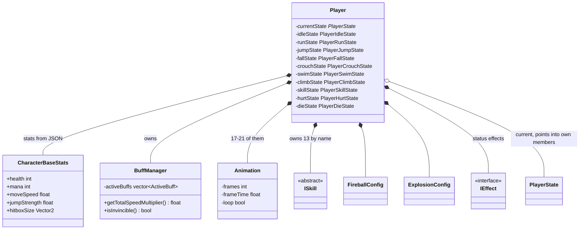

*Diagram 13 — `Player` composition. All ten states are **members by value**; `currentState` is a bare
pointer into them.*

Holding the states by value is a deliberate performance decision. A running player changes state
several times a second, and by-value storage makes a transition a pointer reassignment with **zero
heap allocation**. `Mob` makes the opposite choice — `unique_ptr<IMobState>` — because enemy
transitions are far rarer and the indirection buys the freedom to add states without touching `Mob`.
The same pattern, two trade-offs, each chosen for its access pattern; §5.2 analyses this in detail.

Had characters been modelled by inheritance — `class Goku : public Player` — six subclasses would each
have needed their own stats, animations, skills and configs, and the character-selection preview would
have needed a `switch`. Composing from JSON instead means one class and six data entries.

## 4.7 Resource ownership and RAII

Ownership is explicit everywhere and expressed in the type:

| Relationship | Expressed as | Example |
|---|---|---|
| Exclusive ownership | `unique_ptr<T>` | `BaseLevelState` owns its players, mobs and items |
| Ownership transfer | `unique_ptr<T>` by value | A screen hands its successor to `ChangeStateCommand` |
| Value member | plain member | `Player`'s ten states, `BuffManager`, the three stat structs |
| Shared ownership | `shared_ptr<T>` | `PartyInventory`, held jointly by the level and both players |
| Non-owning observation | raw `T*` | `Mob::targetPlayers`, `ShopUIPanel::buyer_`, `Hitbox::owner` |
| Shared read-only resource | `const T&` from a cache | `AssetManager::getTexture` |

Raw pointers appear **only** for non-owning observation, and never in a destructor's path. This is
what allows destruction order to be arbitrary: no destructor releases a resource that another object
still refers to, because textures and fonts are owned solely by `AssetManager` and released once at
shutdown.

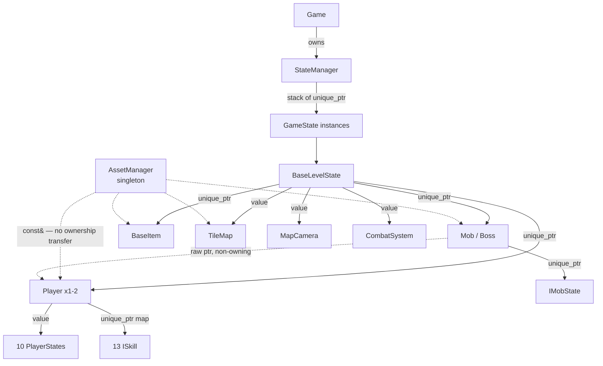

*Diagram 14 — The ownership graph. Solid arrows own; dotted arrows observe.*

## 4.8 SOLID, concretely

| Principle | Where it is visible | The concrete payoff |
|---|---|---|
| **Single responsibility** | The save stack is four classes: DTOs hold data, `JsonSaveSerializer` converts, `FileSaveRepository` stores, `SaveManager` coordinates | Changing the file format touches one class |
| **Open/closed** | Adding an enemy behaviour is a new `IMobState`; adding a screen transition is a new `IGameCommand`; adding a usable item is a new `IItemUseStrategy` | `Mob`, `StateManager` and `Player` are never edited to extend them |
| **Liskov substitution** | Every `BaseItem` can stand in for `Entity`; every `PlayerState` for `PlayerState*` | `BaseLevelState` iterates heterogeneous containers with no type tests |
| **Interface segregation** | `IItemUseStrategy` has exactly one method; `ICameraMode` three; `IBuffEffect` gives neutral defaults so a buff overrides only what it changes | `SpeedBuff` implements two methods, not eleven |
| **Dependency inversion** | `CombatSystem` depends on `ICollisionDetector`, not `BruteForceDetector`; `SaveManager` on `ISaveRepository`, not `FileSaveRepository` | The save layer was unit-tested against a stub repository with no filesystem |

---
---

# 5. Design patterns and the reasoning behind them

## 5.1 The register

Every pattern applied in the project, with where it lives and what it buys.

| Pattern | GoF category | Applied in | The problem it removes |
|---|---|---|---|
| **State** (variant A — by value) | Behavioural | `Player` + 10 `PlayerState` classes | A pyramid of `if` over ten mutually exclusive behaviours; allocation on every transition |
| **State** (variant B — by pointer) | Behavioural | `Mob` / `Boss` + 16 `IMobState` classes | The same pyramid for AI, plus the need to add states without editing `Mob` |
| **Strategy** | Behavioural | `ISkill`, `IItemUseStrategy`, `IEditorTool`, `ICameraMode`, `ISaveSerializer`, `ICollisionDetector` | Hard-wiring one algorithm where several must be selectable at runtime |
| **Command** (pipeline 1) | Behavioural | `IGameCommand` + 3 state commands | A screen destroying itself while its own method is executing |
| **Command** (pipeline 2) | Behavioural | `IPlayerCommand` + 13 input commands | Key codes spread through gameplay code, making rebinding impossible |
| **Simple Factory** | Creational | `PlayerFactory`, `EnemyFactory`, `EntityFactory`, `ItemFactory`, `ItemUsageFactory` | Construction knowledge duplicated at every call site |
| **Singleton** | Creational | `AssetManager`, `SettingsManager`, `ItemAtlasRegistry`, `EditorBlockRegistry`, `DialogueRegistry`, `EditorTextureCache`, and others | Duplicate expensive caches; ambiguity over which copy is authoritative |
| **Memento** | Behavioural | `UndoRedoStack` + `CustomMapData` | Undo needing an exact inverse for every auto-tiled edit |
| **Flyweight** | Structural | `ItemAtlasRegistry` + `AtlasAnimation` | One texture per item instance |
| **Repository** | Architectural | `ISaveRepository` / `FileSaveRepository` | Gameplay code containing file paths |
| **Facade** | Structural | `SaveManager`, `CutsceneManager` | Callers coordinating four subsystems by hand |
| **DTO** | Architectural | `GameSaveData` and its four members | Serialising live objects with behaviour and pointers |
| **Registry** | Architectural | `WorldCatalog`, `DialogueRegistry`, `EditorBlockRegistry` | The same `switch` duplicated in three places and drifting |
| **Template Method** | Behavioural | `Entity::updatePhysicsWithMap` + the `on…` hooks | Every entity re-implementing collision resolution |
| **Producer–Consumer queue** | Architectural | `CommandQueue` + `SpawnCommand` | An entity mutating the entity list while it is being iterated |
| **Dependency injection** | Architectural | `CombatSystem`, `SaveManager`, `MapCamera`, `LoadingState` | Classes constructing their own collaborators and becoming untestable |

The rest of this section explains the four that carry the most weight, then the remainder in brief,
then the four patterns we considered and rejected.

---

## 5.2 State — and why the project has two variants of it

### The problem

A player is doing exactly one of ten things: idle, running, jumping, falling, crouching, swimming,
climbing, using a skill, hurt, or dead. Each responds differently to the same key press. Jumping
while already jumping must not work; attacking mid-air must produce a different attack; being hit must
cancel an attack. Written as conditionals this becomes a function that everything must edit and
nothing can be reasoned about.

### The solution

Each behaviour becomes a class. `PlayerState` derives from the template interface
`IEntityState<Player>` and receives the input hooks (`onMoveLeft`, `onJump`, `onAttack`, `onCrouch`,
`onClimb`, …) plus `onEnter`, `onExit`, `update` and a **`canExit()` guard**.

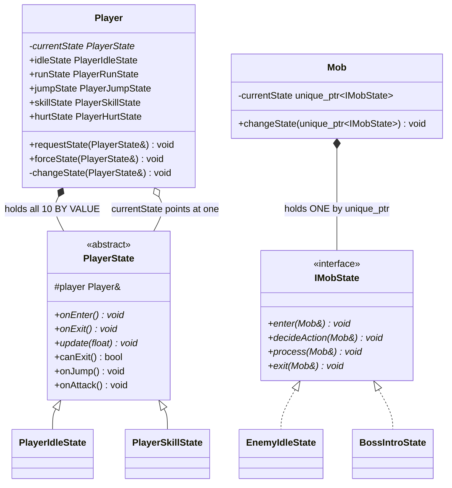

*Diagram 15 — The two State variants side by side.*

### Why two variants

| | Player | Mob / Boss |
|---|---|---|
| Storage | All ten states are **members by value** | One **`unique_ptr<IMobState>`** |
| Transition cost | Pointer reassignment, **zero allocation** | One `make_unique`, one `delete` |
| Transition frequency | Many per second — walk, stop, jump, land | Rare — idle → patrol → chase → attack |
| Extension cost | Adding a state means adding a member to `Player` | Adding a state touches nothing |
| Interface shape | `IEntityState<Player>` — typed reference, no cast | `IMobState` takes `Mob&` per call |

The player's states are hot and few, so the allocation cost dominates and by-value wins. The mob's
states are cold and many — sixteen classes across enemies and bosses, added incrementally throughout
development — so the extension cost dominates and the pointer wins. Choosing differently in the two
places is not an inconsistency; it is the same pattern tuned to two different access patterns.

### `canExit()` — the guard that makes cancellation correct

`requestState()` honours `canExit()`; `forceState()` ignores it. `PlayerSkillState` returns `false`
from `canExit()` while its attack animation is committed, which is why a player cannot walk out of the
middle of a swing. `forceState()` exists for the two cases that must override it: taking a hit, and
respawning. Expressing "you are committed" as a method on the state rather than as a boolean on the
player means the rule lives with the thing it describes.

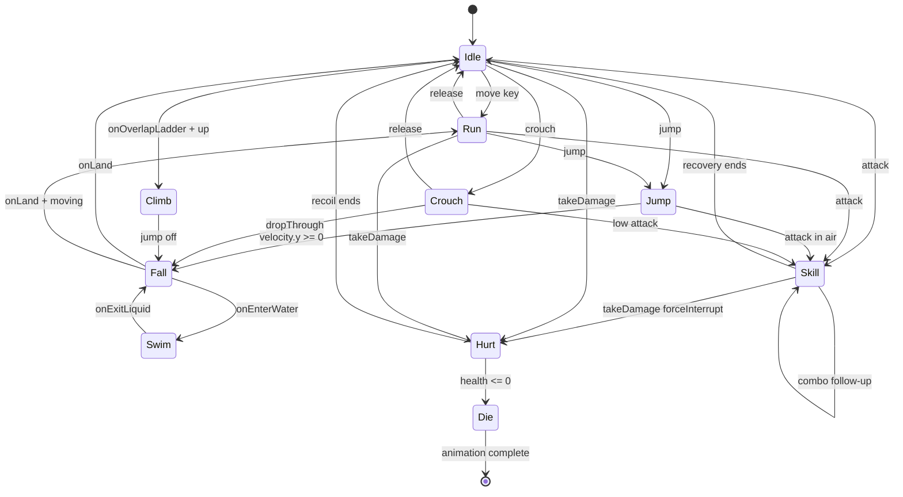

*Diagram 16 — The player state machine. `Skill → Skill` is the combo chain; `Skill → Hurt` is the
`forceState` path that makes cancellation possible.*

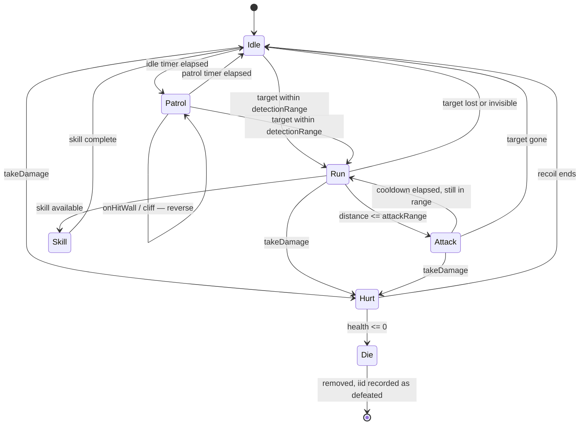

*Diagram 17 — The seven-state enemy AI.*

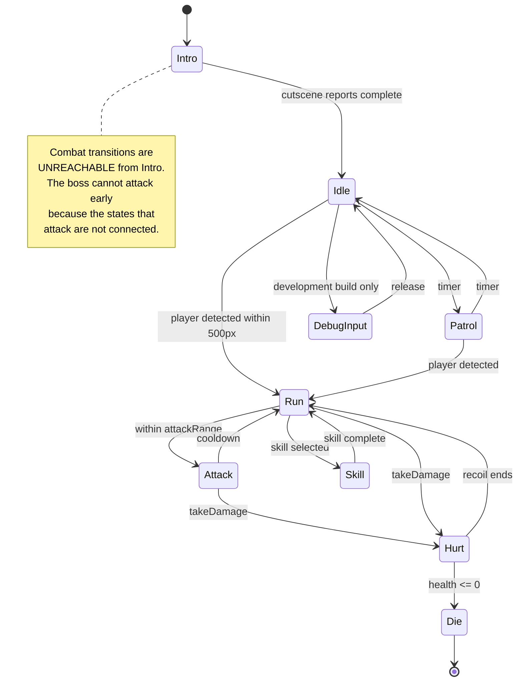

*Diagram 18 — The nine-state boss AI. `Intro` and `DebugInput` are what distinguish it from
Diagram 17.*

`BossDebugInputState` is worth naming: it routes the keyboard into the boss so a developer can step
through each attack and verify hitbox timing without fighting it legitimately. Adding a manual-control
mode required **no change to `Boss` at all** — one more class implementing the same interface. That is
the open/closed principle producing a concrete result rather than a slogan.

### Consequences

**Gained.** Cancellation is structurally correct — a cancelled attack cannot keep emitting a hitbox,
because the state that emitted it no longer exists. Adding the swim behaviour touched no existing
state. The boss intro gate needed no flag.
**Paid.** Twenty-six small classes, and a transition table that lives distributed across them rather
than in one readable place — which is precisely why Diagrams 16–18 are in this report.

---

## 5.3 Strategy — six applications, and one deliberate non-application

### The problem

Six places in the project need an algorithm that varies at runtime and that the caller must not know
about.

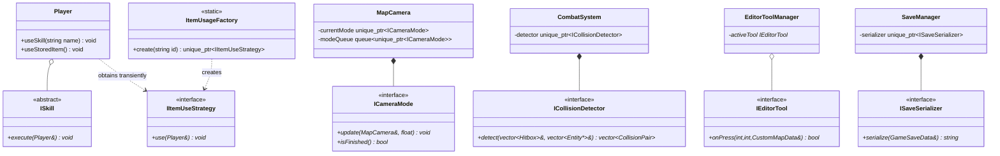

*Diagram 19 — Six Strategy applications.*

| Application | Context | Chosen by | How clean |
|---|---|---|---|
| `IItemUseStrategy` | `Player::useStoredItem()` | `ItemUsageFactory` from the held item's identifier | **Textbook.** One method, chosen by a factory, invoked by a context that learns nothing |
| `ICameraMode` | `MapCamera` | Pushed onto a queue by the cutscene | Clean, and extended with a queue — see below |
| `ICollisionDetector` | `CombatSystem` | Injected at construction | Clean; the reason the save-layer tests could stub it |
| `IEditorTool` | `EditorToolManager` | The palette selection, plus a permanent right-button binding | Clean |
| `ISaveSerializer` | `SaveManager` | Injected at construction | Clean |
| `ISkill` | `Player` | The skill name from the state machine | **Data-heavy.** Most of what differs between skills is timing and damage loaded from JSON rather than differing code — an honest qualification |

### The queue extension

`MapCamera` holds a *current* `ICameraMode` and a **queue** of pending ones. This is the detail worth
noticing: **following the player is not a special default state** — it is simply another entry in the
queue. A cutscene pushes pan, zoom, hold, and finally follow. That is exactly why an interrupted
cutscene recovers correctly: returning to normal is a queued item, not a flag somebody must remember
to reset.

### The deliberate non-application

`BuffManager` looks like Strategy and **is not**. Strategy selects *one* algorithm; `BuffManager`
selects *none* — it holds `vector<ActiveBuff>` and **folds across all of them**:
`getTotalSpeedMultiplier()` multiplies every active contribution, `isInvincible()` returns true if any
active buff claims it.

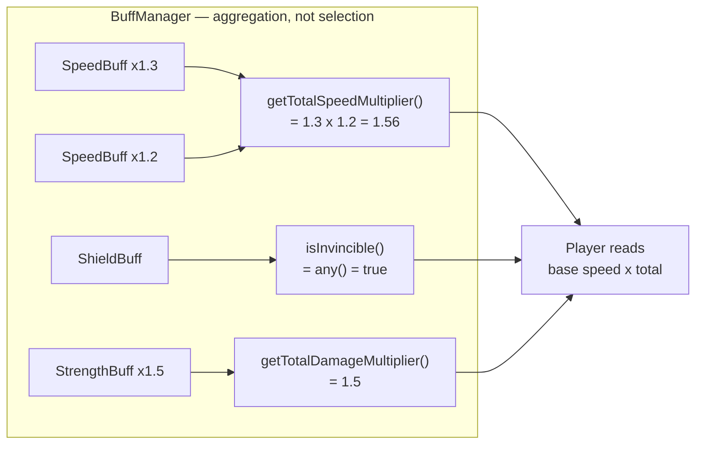

*Diagram 20 — Several effects active simultaneously, contributions summed. Calling this Strategy
would be a mislabel; the accurate name is a **polymorphic modifier collection**.*

Note also that a buff returns a **multiplier** rather than mutating the player's speed. An expiring
buff therefore cannot leave the player permanently fast — a whole class of bug that additive mutation
invites.

---

## 5.4 Command — two independent pipelines

### Pipeline 1: screen transitions

A screen that wants to replace itself cannot call `stateManager.ChangeState(...)` directly — that
destroys the object whose method is currently executing. The fix is to make the transition an
**object** and defer it.

```mermaid
classDiagram
    class GameState {
        <<abstract>>
        -stateCommandQueue vector~unique_ptr~IGameCommand~~
        +PushStateCommand(unique_ptr~IGameCommand~) void
        +ConsumeCommands() vector~unique_ptr~IGameCommand~~
    }
    class IGameCommand {
        <<interface>>
        +Execute(StateManager&)* void
    }
    class PushStateCommand {
        -newState unique_ptr~GameState~
    }
    class PopStateCommand
    class ChangeStateCommand {
        -newState unique_ptr~GameState~
    }
    class StateManager {
        -stateStack stack~unique_ptr~GameState~~
        +PushState(unique_ptr~GameState~) void
        +PopState() void
        +ChangeState(unique_ptr~GameState~) void
    }
    IGameCommand <|.. PushStateCommand
    IGameCommand <|.. PopStateCommand
    IGameCommand <|.. ChangeStateCommand
    GameState o-- IGameCommand : queues
    StateManager ..> IGameCommand : drains and executes
    StateManager *-- GameState : owns the stack
```

*Diagram 21 — Screen transitions as objects. Note that `GameState` owns its own queue: the screen
records its intention locally, and `StateManager` collects it from outside.*

```mermaid
sequenceDiagram
    participant U as Player
    participant S as MapSelectionState
    participant Q as its command queue
    participant SM as StateManager
    participant N as CharacterSelectionState

    U->>S: click NEW GAME
    Note over S: HandleInput phase — only records
    S->>Q: PushStateCommand(ChangeStateCommand)
    Note over S: ...frame continues safely,<br/>S is still alive and still executing
    SM->>S: ConsumeCommands()
    S-->>SM: [ChangeStateCommand]
    Note over SM: no GameState method is<br/>on the call stack now
    SM->>SM: Execute -> pop S, push N
    SM->>S: destructor runs here — safely
    SM->>N: becomes the active screen
```

*Diagram 22 — The deferral. The destructor runs at the one moment nothing is executing inside the
object being destroyed.*

### Pipeline 2: player input

The second pipeline solves a different problem: two players share one keyboard and every key must be
rebindable, so no gameplay code may contain a `KEY_` constant.

```mermaid
classDiagram
    class InputHandler {
        -keyBindings_ unordered_map~int, vector~KeyBinding~~
        +bindKey(int key, unique_ptr~IPlayerCommand~, InputType) void
        +clearBindings() void
        +handleInput() vector~IPlayerCommand*~
    }
    class KeyBinding {
        +command unique_ptr~IPlayerCommand~
        +type InputType
    }
    class IPlayerCommand {
        <<interface>>
        +Execute(Player&)* void
    }
    class SettingsManager {
        <<singleton>>
        -p1Bindings map~Action,int~
        -p2Bindings map~Action,int~
        +SaveToFile() void
    }
    class Player
    InputHandler *-- KeyBinding
    KeyBinding *-- IPlayerCommand
    IPlayerCommand <|.. MoveLeftCommand
    IPlayerCommand <|.. JumpCommand
    IPlayerCommand <|.. AttackCommand
    IPlayerCommand <|.. UseSkillCommand
    IPlayerCommand <|.. DropThroughCommand
    SettingsManager ..> InputHandler : supplies the key map
    IPlayerCommand ..> Player : Execute(receiver)
```

*Diagram 23 — Input as commands. `InputType` distinguishes press, release and hold, which is what
lets `MoveLeftCommand` and `StopLeftCommand` be two separate commands on one key.*

The **Invoker** is `InputHandler`, the **Command** is `IPlayerCommand`, the **Receiver** is `Player`.
Rebinding is `clearBindings()` followed by `bindKey()` with the new key codes — the commands
themselves are untouched. Because `handleInput()` returns a *list* of commands rather than acting, the
first phase of the frame stays a pure read (§7.2).

### Consequences

**Gained.** Two players on one keyboard with independent maps, full rebinding, and a rebind that takes
effect on the next frame. Screens that can safely replace themselves. A loading screen that can carry
a *factory* for its successor rather than the successor itself.
**Paid.** Sixteen small command classes, and one level of indirection between a key press and its
effect.

---

## 5.5 Simple Factory — five of them

Construction knowledge is centralised in five factories, each the single place that knows how to build
a family of objects.

```mermaid
classDiagram
    class PlayerFactory {
        <<static>>
        +create(string name, Vector2 pos) unique_ptr~Player~
    }
    class EnemyFactory {
        <<static>>
        +create(string type, Vector2 pos) unique_ptr~Mob~
    }
    class ItemFactory {
        <<static>>
        +create(LDtkEntityData&) unique_ptr~BaseItem~
    }
    class EntityFactory {
        <<static>>
        +create(SpawnCommand&) unique_ptr~Entity~
    }
    class ItemUsageFactory {
        <<static>>
        +create(string id) unique_ptr~IItemUseStrategy~
    }
    class charactersJson["characters.json"]
    class enemiesJson["enemies.json"]

    charactersJson ..> PlayerFactory : stats, animations,<br/>skills, projectile config
    enemiesJson ..> EnemyFactory : stats, ranges,<br/>animations, skill names
    PlayerFactory ..> Player : builds fully configured
    EnemyFactory ..> Mob
    EnemyFactory ..> Boss
    ItemFactory ..> BaseItem
    EntityFactory ..> Fireball
    EntityFactory ..> Explosion
    ItemUsageFactory ..> IItemUseStrategy
```

*Diagram 24 — The five factories and the two JSON files that drive two of them.*

This is Simple Factory used for its real purpose. It is not there to hide a `new`; it is there so that
"what a Goku is made of" exists in exactly **one** place and cannot drift out of sync between the
character-selection preview, the menu demo, a fresh run and a loaded save — four call sites that all
build a player.

It is deliberately **not** GoF Factory Method. Factory Method requires a hierarchy of creator classes
each overriding a creation step; there is no such hierarchy here and inventing one would add classes
without removing a problem. Naming the pattern accurately matters more than naming an impressive one.

---

## 5.6 Singleton — and its price, stated honestly

Nine services exist once: `AssetManager`, `SettingsManager`, `ItemAtlasRegistry`,
`EditorBlockRegistry`, `EditorTextureCache`, `DialogueRegistry`, and others. Each is a **cache or a
registry**: an expensive, immutable-after-load resource where a second copy would be a bug rather than
a feature. A second `AssetManager` would mean the same texture in video memory twice, and two answers
to "which one do I unload?".

**The price.** Singletons are global state. They make a unit test's setup implicit, they hide
dependencies from a class's signature, and they impose an initialisation order that is not visible in
the code. We contained it two ways: singletons are confined to caches and registries — no singleton
holds *game* state — and the systems we actually needed to test (`CombatSystem`, `SaveManager`,
`MapCamera`) take their collaborators through constructor injection instead. That is why the save
layer could be tested with a stub repository and no filesystem at all.

---

## 5.7 Memento — undo in the editor

### The problem

A single click in the editor can change a dozen cells, because auto-tiling re-evaluates every
neighbour of the cell that changed. Writing an exact inverse for that is possible and fragile.

### The solution

`UndoRedoStack` stores **snapshots of the whole `CustomMapData`** rather than descriptions of edits.

```mermaid
classDiagram
    class UndoRedoStack {
        -undoStack vector~CustomMapData~
        -redoStack vector~CustomMapData~
        -maxDepth int = 50
        +push(CustomMapData&) void
        +undo(CustomMapData&) bool
        +redo(CustomMapData&) bool
        +canUndo() bool
        +canRedo() bool
    }
    class CustomMapData {
        +width int
        +height int
        +tileSize int
        +tiles vector~vector~int~~
        +collision vector~vector~CollisionType~~
        +entities vector~CustomEntityData~
    }
    class MapEditorState {
        -history UndoRedoStack
        -map CustomMapData
    }
    UndoRedoStack o-- CustomMapData : originator snapshots
    MapEditorState *-- UndoRedoStack : caretaker
    MapEditorState *-- CustomMapData : originator
```

*Diagram 25 — Memento. `CustomMapData` is the Originator, the snapshot is the Memento,
`UndoRedoStack` is the Caretaker.*

```mermaid
sequenceDiagram
    participant U as User
    participant E as MapEditorState
    participant T as PlaceTileTool
    participant A as AutoTiler
    participant H as UndoRedoStack

    U->>E: mouse press on a cell
    E->>T: onPress(gx, gy, map)
    T->>T: write the tile
    T->>A: reevaluate(gx, gy) and neighbours
    A-->>T: 9 cells rewritten
    T-->>E: return true — the map changed
    E->>H: push(copy of CustomMapData)
    Note over H: redo stack cleared;<br/>depth capped at 50
    U->>E: Ctrl+Z
    E->>H: undo(map)
    H-->>E: previous snapshot restored — all 9 cells at once
```

*Diagram 26 — Why `IEditorTool::onPress` returns `bool`: it reports whether the map actually changed,
so one history entry is recorded per meaningful action rather than one per frame of a drag.*

**The trade.** Snapshots cost memory — bounded at fifty entries — and buy correctness by construction:
restoring a snapshot cannot get an auto-tiled neighbourhood subtly wrong, because it does not
reconstruct anything.

---

## 5.8 Flyweight — sprite atlases

A room can hold a hundred coins. Each needs a texture, a current frame and a position. The texture is
large and identical for all of them; the frame index and position are small and different.

```mermaid
classDiagram
    class ItemAtlasRegistry {
        <<singleton>>
        -atlases unordered_map~string, Texture2D~
        +getAtlas(string family) Texture2D&
    }
    class AtlasAnimation {
        -atlasName string
        -currentFrame int
        -elapsed float
        -frameRect Rectangle
        +update(float dt) void
        +render(Vector2 pos, float alpha) void
    }
    class Coin
    class Buff
    class ChestNormal
    ItemAtlasRegistry --> AtlasAnimation : INTRINSIC state<br/>shared, stored once
    Coin *-- AtlasAnimation : EXTRINSIC state<br/>per instance
    Buff *-- AtlasAnimation
    ChestNormal *-- AtlasAnimation
```

*Diagram 27 — Flyweight in its textbook form. Intrinsic state (the atlas texture and frame layout) is
shared; extrinsic state (position, current frame, tint) stays with the instance.*

The concrete payoff: adding fifty coins to a room costs fifty small structs, not fifty texture uploads.

---

## 5.9 Repository, Serializer, Facade and DTO — the save stack

This is the most cleanly layered part of the project, and the one where separating concerns paid the
most.

```mermaid
classDiagram
    direction TB
    class BaseLevelState {
        +writeCheckpointSave() void
        +restoreFrom(GameSaveData&) void
    }
    class SaveManager {
        <<facade + singleton>>
        -currentCheckpoint GameSaveData
        -hasCheckpointData bool
        -repository_ unique_ptr~ISaveRepository~
        +setCheckpoint(GameSaveData&) void
        +getCheckpoint() GameSaveData
        +hasCheckpoint() bool
        +listVersions(int world) vector~SaveSlotInfo~
        +createVersion(int, GameSaveData&, SaveSlotInfo&) bool
        +loadVersion(SaveSlotInfo&, GameSaveData&) bool
        +deleteVersion(SaveSlotInfo&) bool
        +setRepository(unique_ptr~ISaveRepository~) void
    }
    class ISaveRepository {
        <<interface>>
        +listVersions(int world)* vector~SaveSlotInfo~
        +createVersion(int, GameSaveData&, SaveSlotInfo&)* bool
        +loadVersion(SaveSlotInfo&, GameSaveData&)* bool
        +deleteVersion(SaveSlotInfo&)* bool
    }
    class FileSaveRepository {
        -serializer_ unique_ptr~ISaveSerializer~
        -rootDir string
    }
    class ISaveSerializer {
        <<interface>>
        +serialize(GameSaveData&)* string
        +deserialize(string)* GameSaveData
    }
    class JsonSaveSerializer
    class GameSaveData {
        <<DTO>>
        +meta SaveMetaData
        +player PlayerSaveData
        +inventory InventorySaveData
        +level LevelSaveData
    }
    class PlayerSaveData {
        <<DTO>>
        +characterName string
        +health int
        +mana float
        +breath float
        +storedItemSlot string
    }
    class InventorySaveData {
        <<DTO>>
        +coins int
        +keys int
    }
    class LevelSaveData {
        <<DTO>>
        +currentRoom string
        +defeatedIids vector~string~
        +changedItems map~string, ItemState~
    }
    class SaveMetaData {
        <<DTO>>
        +version int
        +timestamp string
        +playtimeSeconds float
    }
    class SaveSlotInfo {
        +world int
        +version int
        +characterName string
        +room string
        +coins int
        +health int
        +playtime float
    }

    BaseLevelState ..> SaveManager : the only entry point
    SaveManager *-- ISaveRepository : injectable, lazily built
    FileSaveRepository *-- ISaveSerializer : injected
    ISaveRepository <|.. FileSaveRepository
    ISaveSerializer <|.. JsonSaveSerializer
    SaveManager ..> GameSaveData
    GameSaveData *-- SaveMetaData
    GameSaveData *-- PlayerSaveData
    GameSaveData *-- InventorySaveData
    GameSaveData *-- LevelSaveData
    ISaveRepository ..> SaveSlotInfo : lists without deserialising
```

*Diagram 28 — Four layers, each with one responsibility.*

| Layer | Class | Responsibility | What it does **not** know |
|---|---|---|---|
| **DTO** | `GameSaveData` + 4 members | Hold data | Anything. No behaviour, no pointers |
| **Serializer** | `JsonSaveSerializer` | DTO ↔ text | Where the text goes |
| **Repository** | `FileSaveRepository` | Where bytes live; atomic write; version numbering; listing | What the bytes mean |
| **Facade** | `SaveManager` | Coordinate them; expose four disk verbs | `std::filesystem`, or JSON |

`SaveManager` carries **two responsibilities that must not be confused**, and the header says so
explicitly. The first is the **in-RAM checkpoint** — `setCheckpoint` / `getCheckpoint` /
`hasCheckpoint` / `clearCheckpoint` — used for respawning after death, which never touches the disk
and is therefore instant. The second is the **on-disk version set** — `listVersions`, `createVersion`,
`loadVersion`, `deleteVersion` — delegated entirely to `ISaveRepository`. The repository is built
**lazily** on first use and can be replaced through `setRepository()`, which is exactly how the test
harness injected a stub and ran the whole save layer with no filesystem.

**Why DTOs matter here.** Serialising live objects means serialising behaviour, pointers and
partially-updated state. Converting to plain structs first means the save format depends on the
*data* rather than on the *classes*, which is why a refactor of `Player` did not break saved games.

**Why `SaveSlotInfo` is separate.** Listing twenty saves must not deserialise twenty complete world
snapshots. A small summary struct is what keeps the save browser instant.

**Robustness.** The layer was tested with 38 assertions covering round-trip fidelity, corrupt JSON,
`tileSize: 0`, negative and absurd map dimensions, out-of-range keys, slot bounds and atomic overwrite.
One finding worth recording: `nlohmann::json`'s const `operator[]` **dereferences `end()` under
`NDEBUG`** rather than throwing, so every read goes through `.value(key, default)` instead.

---

## 5.10 The remaining patterns, in brief

**Registry — `WorldCatalog`.** Six worlds, each with a name, a `.ldtk` path, a save folder and a
factory for its level screen. Before this existed, the same `switch (worldIndex)` was duplicated in
the map-selection screen, the load path and the save path — three places that could disagree, and did.
One lookup replaced all three, which is why the new-game and load-game routes cannot send the player
to different worlds for the same click. `DialogueRegistry` and `EditorBlockRegistry` do the same for
conversations and placeable blocks.

**Template Method — `Entity::updatePhysicsWithMap`.** The algorithm is fixed: apply gravity, resolve
the X axis, resolve the Y axis, handle triggers. The variation is in the hooks: `onHitWall`,
`onLand`, `onHitCeiling`, `onEnterWater`, `onExitLiquid`, `onOverlapLadder`, `onHazard`, `onCollide`,
`onDie`. A player uses `onLand` for landing recovery; a cautious enemy uses `onHitWall(…, isCliff)` to
turn around at a ledge. One implementation of collision resolution serves every moving object in the
game — which is why fixing a slope bug fixed it for enemies and thrown bombs at the same time.

**Producer–Consumer queue — `CommandQueue` + `SpawnCommand`.** An entity that wants to create another
entity cannot insert into the list currently being iterated. `SpawnCommand` is a plain struct
describing what to make — category, type, position, velocity, facing, owner name, `iid`, spawner and
an optional on-hit callback — and entities push it while the level drains it at a safe point. Note
that this queue is **data**, not polymorphic commands: there is no behaviour to vary, only a
description to carry, so a struct is the honest choice.

**Facade — `CutsceneManager`.** Coordinates three subsystems that know nothing about each other:
it suppresses player input, pushes camera modes onto `MapCamera`'s queue, and drives `DialogueBox`.
One call site instead of three.

**Dependency injection.** `CombatSystem` receives an `ICollisionDetector`; `SaveManager` receives a
repository and a serializer; `LoadingState` receives a `std::function` factory for its successor
rather than the successor itself — which is precisely what makes the deferred construction in §2.1
possible.

---

## 5.11 Patterns considered and deliberately not adopted

Naming what we did *not* use, and why, is part of showing that the patterns we did use were chosen
rather than reached for.

| Pattern | Why it was considered | Why we did not adopt it |
|---|---|---|
| **Object Pool** | Projectiles and explosions are created and destroyed frequently | We measured the entity counts: a busy frame has tens of entities, not thousands. A pool would add lifetime-management complexity and a class of "used a recycled object that was still referenced" bugs to solve a cost we could not detect. Revisit if entity counts grow by an order of magnitude |
| **Observer / EventBus** | Several systems react to the same events — a death, a pickup, a room change | With two developers and a known set of listeners, direct calls and the existing queues are easier to follow. A bus would make the *actual* call graph invisible at exactly the moment we most needed to reason about ordering, since the four-phase rule is about ordering |
| **Entity–Component–System** | The entity hierarchy has genuine cross-cutting concerns | ECS is a whole-architecture commitment. Adopting it partway through, with a working `Entity` hierarchy and a shipped physics contract, would have meant rewriting everything for a benefit that appears at entity counts we do not reach |
| **Full MVC** | The reference architecture for separating presentation from logic | We describe the project honestly as a **screen-stack state machine over self-rendering entities**. Entities render themselves; there is no separate View layer. Claiming MVC would be a mislabel, and the report's value depends on its labels being accurate |

---
---

# 6. Code organisation — what every group of files is responsible for

## 6.1 The tree

328 C++ files, 23,735 lines. Headers mirror sources: `include/<module>/X.h` pairs with
`src/<module>/X.cpp`.

| Module | Headers | Sources | Lines | Responsibility |
|---|---|---|---|---|
| `entity/` (all sub-modules) | 88 | 60 | 8,114 | Everything that exists in the world and acts |
| `states/` | 17 | 15 | 4,196 | Screens, and the level base class |
| `ui/` | 14 | 12 | 3,676 | Panels, widgets, HUD, transitions, scaling |
| `editor/` | 25 | 17 | 3,351 | The map editor |
| `environment/` | 6 | 5 | 1,541 | Level loading, terrain, camera |
| `save/` | 10 | 2 | 603 | Persistence |
| `core/` | 6 | 6 | — | Loop, state stack, input, settings |
| `command/` | 6 | — | — | The two command families and the spawn queue |
| `combatsystem/` | 4 | 2 | — | Hitbox resolution |
| `dialogue/` | 4 | 3 | — | Conversations |
| `cutscene/` | 3 | 2 | — | Scripted sequences |
| `infrastructure/` | 2 | 2 | — | Asset cache, GIF decoding |

```mermaid
flowchart TD
    CORE["core/<br/>Game · StateManager · InputHandler · SettingsManager · SaveManager"]
    STATES["states/<br/>GameState · BaseLevelState · 6 worlds · menus · editor screen"]
    CMD["command/<br/>IGameCommand · IPlayerCommand · CommandQueue · SpawnCommand"]
    ENT["entity/<br/>Entity · Player · Mob · Boss · BaseItem · Fireball · Explosion"]
    ENV["environment/<br/>TileMap · MapCamera · ICameraMode"]
    CBT["combatsystem/<br/>CombatSystem · Hitbox · ICollisionDetector"]
    UI["ui/<br/>IMenuPanel · ButtonGroup · panels · PlayerHUD · UIScaler"]
    ED["editor/<br/>tools · palettes · AutoTiler · UndoRedoStack · serializer"]
    SAVE["save/<br/>DTOs · ISaveSerializer · ISaveRepository"]
    CUT["cutscene/ + dialogue/"]
    INF["infrastructure/<br/>AssetManager · GifAnimation"]

    CORE --> STATES
    CORE --> CMD
    STATES --> ENT
    STATES --> ENV
    STATES --> CBT
    STATES --> UI
    STATES --> SAVE
    STATES --> CUT
    ED --> ENV
    ED --> ENT
    ENT --> CMD
    ENT --> ENV
    CBT --> ENT
    CUT --> ENV
    ENT -.-> INF
    UI -.-> INF
    ENV -.-> INF
    ED -.-> INF
```

*Diagram 29 — Module dependencies. Arrows point from user to used. `infrastructure/` is depended on
by everything and depends on nothing — which is what makes it safe to be a singleton.*

The graph has **no cycles**. `entity/` never includes `states/`; the level tells entities what to do,
and entities communicate back through the spawn queue and virtual callbacks rather than by calling
into the screen.

## 6.2 `core/` — the loop and the global services

| File(s) | Responsibility |
|---|---|
| `Game.h/.cpp` | Owns the `StateManager` and runs the frame loop: clamp `dt`, accumulate, drain in fixed steps, render once with an interpolation `alpha`. The whole timing policy is here and nowhere else |
| `StateManager.h/.cpp` | Owns `stack<unique_ptr<GameState>>`; forwards the four phases; drains each state's command queue between frames |
| `InputHandler.h/.cpp` | The **only** code that reads the keyboard for gameplay. Maps key codes to `IPlayerCommand` objects with an `InputType` (press / release / hold) and returns a list of commands to execute |
| `SettingsManager.h/.cpp` | Singleton holding both players' key maps and the four volume channels; writes `session.json` on every change |
| `SaveManager.h/.cpp` | Facade over the save stack; also holds the in-RAM respawn checkpoint |
| `SaveData.h` | Backward-compatible aggregator header that pulls in the `save/` DTOs, so older includes still compile |

## 6.3 `states/` — screens

| File(s) | Responsibility |
|---|---|
| `GameState.h` | The four-phase contract plus each screen's private `IGameCommand` queue |
| `BaseLevelState.h/.cpp` | **The largest and most important class.** Owns the map, the players, the mobs, the items, the camera, the combat system, the spawn queue and the shared inventory. Runs the four phases across all of them, handles room transitions, checkpointing, respawn, HUD and the pause panel. `initWorldFromLoadedMap()` is the shared constructor helper that all six worlds and the custom-map path call |
| `World01State` … `World06State` | Per-world setup only — which map file, which spawn, which cutscenes |
| `MainMenuState` | Inherits `BaseLevelState`, so the menu genuinely runs a level behind its buttons, with two AI-driven demo characters |
| `MapSelectionState` | The six world nodes; opens `WorldActionPanel` and `SaveVersionPanel` |
| `CharacterSelectionState` | Six cards, live preview with skill demo, two-pass picking for co-op and versus |
| `LoadingState` | Holds a `std::function` factory for its successor and invokes it partway through its animation |
| `EndgameState` | Two outcomes — level completed, or the versus winner's podium |
| `IntroState` | The opening sequence |
| `MapEditorState` | The editor screen; hosts the tool manager, palettes, undo stack and test-play launch |
| `WorldCatalog.h/.cpp`, `WorldDescriptor.h` | The world registry (§5.10) |

## 6.4 `command/` — deferred action

| File(s) | Responsibility |
|---|---|
| `IGameCommand.h`, `StateCommands.h` | Screen transitions as objects: push, pop, change |
| `IPlayerCommand.h`, `PlayerCommands.h` | Thirteen input commands: move, stop, jump, crouch, climb, attack, use skill, interact, drop through |
| `SpawnCommand.h` | A **data** struct describing an entity to create: category, type, position, velocity, facing, owner name, `iid`, spawner, on-hit callback |
| `CommandQueue.h` | The spawn queue. `popAll()` drains everything; `peekAndConsumeByCategory()` drains one category, which is what lets `Process` handle explosion damage separately from `Update` handling spawns |

## 6.5 `entity/` — the world's inhabitants

**Core (`include/entity/`, 15 headers).** `Entity` is the abstract base carrying the three stat
structs, the physics Template Method, the fifteen virtual event hooks, the faction, the `iid` and the
spawn-queue pointer. `Player`, `Mob`, `Boss`, `BaseItem`, `Fireball` and `Explosion` derive from it.
`Animation` decodes a sprite strip into timed frames. `IEffect`, with `PoisonEffect` and `LavaEffect`
implementing it, is the timed status-effect family. `FloatingText` is the rising damage number — deliberately *not* an entity, because it has no
collision, no faction and no physics. `EntityFaction.h` is the bitmask enum on which all damage
permission turns. `IEntityState.h` and `IMobState.h` are the two behaviour interfaces.
`EnemyFactory` and `EntityFactory` build mobs and projectiles from data.

**`entity/Player/` (16 headers).** `Player` itself; `CharacterStats.h`, the header holding the three stat
structs *and* `PartyInventory`; `PlayerFactory` which assembles a character from JSON; `BuffManager` which
aggregates active buffs; and the ten state classes plus `PlayerState` and the `PlayerStates.h`
convenience header.

**`entity/Skill/` (15 headers).** `ISkill` and its ten player skills; `IEnemySkill` and its three
enemy archetypes. A skill carries its mana cost, its animation name, its hit window, its pacing
timings, its damage and defence values, its hitbox rectangle, its dash multiplier and — the detail
that makes combos data — the name of the skill that may follow it.

**`entity/Item/` (23 headers).** `BaseItem` and thirteen item types; `AtlasAnimation` and
`ItemAtlasRegistry` implementing Flyweight; `ItemState.h` recording what has changed for the save
system; `ItemFactory` building items from LDtk records; `IItemUseStrategy` with its three
implementations and `ItemUsageFactory`.

**`entity/BuffEffects/` (10 headers).** `IBuffEffect` and nine buffs.

**`entity/EnemyStates/` (7) and `entity/BossStates/` (9).** The sixteen AI behaviours.

## 6.6 `environment/` — terrain and camera

| File(s) | Responsibility |
|---|---|
| `TileMap.h/.cpp` | **The heart of the level pipeline.** Two loaders (`LoadLDtkMap`, `LoadCustomMap`) producing one internal model; the tile layers; the `CollisionType` grid; the pre-rendered background canvas; `GetCollidingTiles` for physics; `GetNeighbour` for room transitions; `GetPlayerSpawns` and `GetEntityData` for construction; the world-scale derivation that lets 16px and 32px maps coexist |
| `MapCamera.h/.cpp` | Holds the current `ICameraMode` and the queue of pending ones; wraps raylib's `Camera2D` |
| `ICameraMode.h`, `CameraFollowMode`, `CameraPanMode`, `CameraZoomMode` | The three camera behaviours |

## 6.7 `combatsystem/` — damage resolution

| File(s) | Responsibility |
|---|---|
| `Hitbox.h` | A rectangle plus damage, defence, owner, ignored entity and a target faction mask, with `canHit(EntityFaction)` |
| `ICollisionDetector.h` | The pluggable detection step |
| `BruteForceDetector.h/.cpp` | Every hitbox against every entity — adequate at this project's counts |
| `CombatSystem.h/.cpp` | Collects the frame's hitboxes, resolves pairs, applies damage, defence, knockback direction and hit-stop, and can render the debug hitbox overlay |

## 6.8 `editor/` — the map editor (25 headers, the second-largest module)

| Group | Files | Responsibility |
|---|---|---|
| **Data model** | `CustomMapData.h`, `CustomEntityData.h`, `EditorBlockDef.h`, `EntityDef.h` | What a custom map *is*: dimensions, tile grid, collision grid, entity records |
| **Tools** | `IEditorTool.h`, `PlaceTileTool`, `PlaceEntityTool`, `EraseTool`, `EditorToolManager`, `EditorToolType.h` | Strategy: what a click does. `onPress`/`onDrag` return `bool` — "did the map change?" — which drives undo granularity; `renderGhost` draws the placement preview |
| **Palettes** | `CategoryPanel`, `BlockVariantPanel`, `EntityPalette`, `EditorBottomPanel`, `EditorBlockRegistry`, `IconFit.h` | Browsing and selecting what to place. `IconFit` normalises icons drawn from five tilesets with different tile sizes |
| **Auto-tiling** | `AutoTiler.h/.cpp` | Implements LDtk's own rule-group model against `extracted_rules.json` |
| **History** | `UndoRedoStack.h/.cpp` | Memento, fifty snapshots deep |
| **Canvas** | `EditorCamera`, `EditorMapResizer` | Pan/zoom and screen↔grid conversion; drag-to-resize with content-preserving offset |
| **Persistence** | `CustomMapSerializer`, `EditorSaveLoadUI`, `SaveLoadMode.h`, `CustomMapValidator` | JSON save/load to slots, and the pre-flight check that refuses to launch a map with no spawn or no exit |
| **Assets** | `EditorTextureCache` | Keeps the five tilesets loaded for the session |

## 6.9 `save/` — persistence (10 headers, 603 lines)

Four DTOs (`PlayerSaveData`, `InventorySaveData`, `LevelSaveData`, `SaveMetaData`) aggregated by
`GameSaveData`; the summary struct `SaveSlotInfo`; the two interfaces `ISaveSerializer` and
`ISaveRepository`; and their implementations `JsonSaveSerializer` and `FileSaveRepository`. Analysed
in §5.9.

## 6.10 `ui/` — the interface layer

| File(s) | Responsibility |
|---|---|
| `UIScaler.h/.cpp` | The virtual 2560×1440 canvas. `S()` converts a length; `X()`, `Y()`, `Pos()`, `Rect()` convert positions and add the letterbox offset |
| `IMenuPanel.h` | The common panel contract with entry/exit animation hooks and a close callback |
| `ButtonGroup.h/.cpp` | The composite widget host: buttons with staggered entry delays, tabs, key-binding rows, volume sliders bound by getter/setter callbacks, and scrolling |
| `PanelButton.h/.cpp` | The standalone image button. `HandleInput` only records; `ConsumeClick()` yields the click once — this is the four-phase rule at widget scale |
| `Buttons.h/.cpp` | A fluent simple button: `setPosition().setSize().setLabel().setOnClick()` |
| `WorldActionPanel`, `SaveVersionPanel`, `CharacterInfoPanel` | The three game-flow panels |
| `ShopUIPanel` | The scrollable purchase catalogue |
| `IngameSettingsPanel` | The in-level pause and settings panel, reusing `ButtonGroup` |
| `PlayerHUD.h/.cpp` | A stateless renderer — one static call reading live objects, owning nothing |
| `UIAtlasAnimator` | The page-turn sprite sequence used by panels |
| `transitions/ITransition.h`, `IrisTransition` | The circular wipe, which also serves as the input lock during a screen change |

## 6.11 `cutscene/` and `dialogue/`

`CutsceneManager` is a Facade over three subsystems (input suppression, camera queue, dialogue box).
`CutsceneTrigger` is built from an LDtk entity record and reads its parameters from that entity's
custom fields. `CutsceneScript.h` describes a sequence. `DialogueRegistry` loads all conversations
from JSON via `DialogueLoader` and stores them as `DialogueSequence` objects, each a list of
`DialogueLine` records carrying a speaker and a line; `DialogueBox` renders the typewriter reveal.

## 6.12 `infrastructure/`

`AssetManager` is the single owner of every texture, font and sound — three caches keyed by logical
name, one `unloadAll()` at shutdown. `GifAnimation` wraps raylib's `LoadImageAnim`, decoding every
frame once and advancing by `UpdateTexture` into a single reused texture.

## 6.13 Build

`CMakeLists.txt` lists sources **explicitly** with `set(SOURCES ...)` rather than globbing, so a file
that is not built is visible in the diff rather than silently absent. raylib ships as a vendored
prebuilt static library and nlohmann/json as a vendored header-only library under `third_party/`, so
the project needs no package manager and builds on a machine that has never seen it. Two presets are
maintained: `windows-msvc` and `windows-mingw`.

---
---

# 7. The four-phase game loop

## 7.1 Why the loop is shaped this way

Two rules govern every frame, and everything else follows from them.

**Rule 1 — fixed timestep.** Simulation advances in fixed 1/60 s slices, decoupled from the display
rate. Without this, jump heights and attack hit windows would differ between a 30 FPS laptop and a
240 Hz desktop.

**Rule 2 — four phases that never interleave.** Reading input, deciding, mutating and drawing are
separate passes over the whole world. Nothing is half-updated while something else draws it, and
nothing is destroyed while something else iterates it.

```mermaid
flowchart TD
    START(["frame begins"]) --> DT["dt = GetFrameTime()"]
    DT --> CLAMP["dt = min(dt, 0.25)<br/>frame-spike clamp"]
    CLAMP --> ACC["accumulator += dt"]
    ACC --> HI["PHASE 1 — HandleInput()<br/>once per real frame"]
    HI --> PR["PHASE 2 — Process()<br/>once per real frame"]
    PR --> EMPTY{"state stack<br/>empty?"}
    EMPTY -- yes --> EXIT(["exit"])
    EMPTY -- no --> LOOP{"accumulator<br/>>= 1/60 ?"}
    LOOP -- yes --> UPD["PHASE 3 — Update(1/60)<br/>zero, one or MANY times"]
    UPD --> SUB["accumulator -= 1/60"]
    SUB --> LOOP
    LOOP -- no --> ALPHA["alpha = accumulator / fixedDt"]
    ALPHA --> RND["PHASE 4 — Render(alpha)<br/>exactly once, const"]
    RND --> START
```

*Diagram 30 — The frame. Note that phases 1, 2 and 4 run once per displayed frame while phase 3 runs
a variable number of times — which is precisely why phase 3 is the only one allowed to mutate.*

## 7.2 Phase 1 — `HandleInput()`

**Contract: read only. Record what happened; change nothing.**

```mermaid
sequenceDiagram
    participant G as Game
    participant SM as StateManager
    participant L as BaseLevelState
    participant IH as InputHandler
    participant P as Player
    participant PS as current PlayerState
    participant W as widgets

    G->>SM: HandleInput()
    SM->>L: HandleInput() on top of stack
    L->>IH: handleInput()
    Note over IH: consults SettingsManager key map,<br/>tests press / release / hold
    IH-->>L: vector<IPlayerCommand*>
    loop each command
        L->>P: cmd->Execute(player)
        P->>PS: onJump() / onMoveLeft() / onAttack()
        Note over PS: records intent —<br/>e.g. requestState(jumpState)
    end
    L->>W: HandleInput(mouse, pressed, released)
    Note over W: PanelButton only sets clicked_ = true
```

*Diagram 31 — Phase 1. `InputHandler` returns a list rather than acting, so the read stays pure.*

## 7.3 Phase 2 — `Process()`

**Contract: act on what phase 1 recorded, and service everything deferred.** This is where the two
command queues drain, where spawn requests become entities, and where AI makes decisions.

```mermaid
sequenceDiagram
    participant SM as StateManager
    participant L as BaseLevelState
    participant M as each Mob
    participant MS as its IMobState
    participant CQ as CommandQueue
    participant EF as EntityFactory
    participant W as widgets

    SM->>L: Process()
    loop each mob
        L->>M: decideAction()
        M->>MS: decideAction(mob)
        Note over MS: distance to target?<br/>cooldown elapsed?<br/>ledge ahead?<br/>-> maybe changeState
        L->>M: process()
        M->>MS: process(mob)
    end
    L->>W: ConsumeClick() on each widget
    Note over L: a click may now enqueue<br/>an IGameCommand — safely
    L->>CQ: popAll()
    CQ-->>L: vector<SpawnCommand>
    loop each spawn request
        L->>EF: create(cmd)
        EF-->>L: unique_ptr<Entity>
        Note over L: inserted here — nothing<br/>is iterating the list now
    end
    SM->>L: ConsumeCommands()
    L-->>SM: queued IGameCommands
    SM->>SM: execute -> push / pop / change state
```

*Diagram 32 — Phase 2. Entity insertion and screen destruction both happen here, at the one point in
the frame where no container is being iterated.*

## 7.4 Phase 3 — `Update(dt)`

**Contract: the only phase that mutates simulation state, and the only one at fixed timestep.** It may
run zero times in a fast frame and several times after a slow one.

```mermaid
sequenceDiagram
    participant SM as StateManager
    participant L as BaseLevelState
    participant P as Player
    participant PS as PlayerState
    participant E as Entity base
    participant TM as TileMap
    participant BM as BuffManager
    participant CS as CombatSystem
    participant CAM as MapCamera

    SM->>L: Update(1/60)
    L->>P: update(dt)
    P->>PS: update(dt)
    Note over PS: advance animation,<br/>advance skill timer,<br/>evaluate transitions
    P->>BM: update(dt, player)
    Note over BM: tick durations,<br/>drop expired buffs
    P->>E: updatePhysicsWithMap(map, solids, dt)
    E->>E: applyGravity(dt)
    E->>TM: GetCollidingTiles(rect)
    TM-->>E: overlapping tiles + CollisionType
    E->>E: resolveCollisionX() then resolveCollisionY()
    E->>P: onLand() / onHitWall() / onEnterWater() / onHazard()
    Note over P: hooks feed the state machine
    L->>CS: update(entities, dt)
    CS->>CS: gather hitboxes -> detect -> apply damage,<br/>defence, knockback, hit-stop
    L->>CAM: Update(target, vel, mapW, mapH, dt, target2)
    L->>L: check room transition, checkpoint,<br/>death, level completion
```

*Diagram 33 — Phase 3. Axes are resolved separately — X first, then Y — which is what makes slopes and
corners behave.*

## 7.5 Phase 4 — `Render(alpha)`

**Contract: `const`. Draws, mutates nothing.** `alpha` is the fraction of a simulation step already
elapsed, available for interpolating between the last two states.

```mermaid
flowchart TD
    R["StateManager::Render(alpha) const"] --> S1["Level draws in world space"]
    S1 --> C1["MapCamera::BeginMode()"]
    C1 --> BG["TileMap::Draw()<br/>one pre-rendered texture"]
    BG --> IT["items — AtlasAnimation"]
    IT --> MO["mobs and bosses"]
    MO --> PL["players + status overlays + buff auras"]
    PL --> FX["fireballs, explosions, floating text"]
    FX --> DBG{"debug<br/>enabled?"}
    DBG -- yes --> HB["CombatSystem::renderDebug()<br/>hitbox outlines"]
    DBG -- no --> C2
    HB --> C2["MapCamera::EndMode()"]
    C2 --> S2["Screen space — no camera"]
    S2 --> HUD["PlayerHUD::render(p1, p2, inventory)"]
    HUD --> PAN["open panels — shop, settings, dialogue"]
    PAN --> TR["ITransition::Render()<br/>iris wipe on top of everything"]
```

*Diagram 34 — Phase 4. The camera transform brackets world-space drawing; the HUD, panels and
transition are drawn outside it in screen space.*

## 7.6 The complete frame

```mermaid
sequenceDiagram
    autonumber
    participant OS as raylib
    participant G as Game
    participant SM as StateManager
    participant L as BaseLevelState
    participant ENT as entities
    participant CS as CombatSystem

    OS-->>G: GetFrameTime()
    G->>G: clamp to 0.25s, accumulate
    G->>SM: HandleInput()
    SM->>L: HandleInput()
    L->>ENT: input commands -> state hooks
    G->>SM: Process()
    SM->>L: Process()
    L->>ENT: decideAction() + process()
    L->>L: drain spawn queue -> construct entities
    SM->>SM: drain IGameCommand queue -> stack changes
    loop while accumulator >= 1/60
        G->>SM: Update(1/60)
        SM->>L: Update(1/60)
        L->>ENT: update(dt) -> physics -> collision hooks
        L->>CS: resolve all hitboxes for this step
    end
    G->>G: alpha = accumulator / fixedDt
    G->>SM: Render(alpha) const
    SM->>L: Render(alpha)
    L->>ENT: render(alpha)
    G->>OS: EndDrawing()
```

*Diagram 35 — One complete frame end to end.*

---
---

# 8. Key technical mechanisms

## 8.1 How a map is authored, exported and loaded — the LDtk ↔ JSON ↔ C++ relationship

This is the single most important pipeline in the project, because both content routes flow through
it.

### The tool

Levels are drawn in **LDtk**, a free level editor. A designer works with layers, tilesets, auto-layer
rules, entity definitions with typed custom fields, and a world grid that positions levels relative to
one another. An LDtk project saves as a **single `.ldtk` file, which is JSON**.

There is deliberately **no export step**. The game reads the `.ldtk` file directly. An export stage
would mean a second format to keep in sync and a step someone can forget; reading the authoring format
means what the designer saved is exactly what the game loads.

### What the game takes out of that JSON

```mermaid
flowchart TD
    subgraph AUTHOR["Authoring — LDtk application"]
        A1["Tile layers<br/>drawn with a tileset"]
        A2["IntGrid layer<br/>one integer per cell"]
        A3["Entities placed,<br/>each with custom fields"]
        A4["World grid<br/>levels positioned + neighbours"]
        A5["Auto-layer rule groups"]
    end
    LDTK[("worldNN.ldtk<br/>ONE JSON file")]
    A1 --> LDTK
    A2 --> LDTK
    A3 --> LDTK
    A4 --> LDTK
    A5 --> LDTK

    LDTK -->|"nlohmann/json parse"| TM["TileMap::LoadLDtkMap(path, levelName)"]

    subgraph MODEL["The one internal model"]
        M1["backgroundLayer / displayLayer<br/>vector&lt;vector&lt;int&gt;&gt;"]
        M2["collisionLayer<br/>vector&lt;vector&lt;CollisionType&gt;&gt;<br/>13 values"]
        M3["entityData_<br/>vector&lt;LDtkEntityData&gt;<br/>identifier, px, iid, fields"]
        M4["currentNeighbours<br/>direction -> room name"]
        M5["playerSpawns<br/>vector&lt;Vector2&gt;"]
    end
    TM --> M1
    TM --> M2
    TM --> M3
    TM --> M4
    TM --> M5

    M1 --> RC["mapCanvas<br/>composited ONCE into<br/>a RenderTexture2D"]
    M2 --> PHY["Entity::updatePhysicsWithMap<br/>GetCollidingTiles(rect)"]
    M3 --> FAC["ItemFactory / EnemyFactory /<br/>CutsceneTrigger"]
    M4 --> RT["BaseLevelState::transitionToRoom"]
    M5 --> SPW["Player placement"]
    A5 -->|"exported once"| ER[("extracted_rules.json")]
    ER --> AT["AutoTiler — the in-game editor<br/>reuses LDtk's real rules"]
```

*Diagram 36 — The LDtk pipeline. One authoring file becomes five internal structures, each consumed
by a different subsystem.*

### The three JSON roles, kept distinct

The project uses JSON for three genuinely different jobs, and confusing them would be a design error:

| Role | Files | Written by | Read by | Nature |
|---|---|---|---|---|
| **Level content** | `assets/maps/*/world0N.ldtk` (14 files) | The LDtk application | `TileMap::LoadLDtkMap` | Authored, read-only at runtime |
| **Game configuration** | `characters.json`, `enemies.json`, dialogue, `extracted_rules.json` | Us, by hand | Factories, registries, `AutoTiler` | Authored, read-only at runtime |
| **Player state** | `saves/world0X/versionY.json`, `session.json`, editor map slots | The game | The game | Generated, read **and** written |

All three go through the same library — nlohmann/json, vendored header-only — but through different
code paths, because the failure modes differ. A malformed configuration file is a development error
and reports loudly; a malformed *save* file is something a grader's machine might genuinely produce,
so the save path validates every field and falls back rather than crashing.

### `iid` — the field that makes persistence possible

Every entity LDtk places carries a stable unique identifier, its `iid`, which survives saving,
reloading and reconstruction. `Entity` stores it. `LevelSaveData` records the `iid`s of defeated
enemies and a map of changed item states keyed by `iid`.

Without stable identity, "this specific goblin is dead" is not expressible — position-based matching
breaks the moment two identical goblins stand near each other. This is the strongest practical
argument in the project for using a real level format rather than an ad-hoc one, and it is why
opened chests stay open and defeated enemies stay defeated across both room changes and reloads.

### The second producer — the in-game editor

```mermaid
flowchart LR
    subgraph P1["Producer 1 — the campaign"]
        L1["LDtk application"] --> L2[("worldNN.ldtk")]
        L2 --> L3["TileMap::LoadLDtkMap"]
    end
    subgraph P2["Producer 2 — the in-game editor"]
        E1["MapEditorState"] --> E2["CustomMapData<br/>in memory"]
        E2 --> E3["CustomMapSerializer"]
        E3 --> E4[("custom map slot .json")]
        E4 --> E3
        E2 --> E5["TileMap::LoadCustomMap"]
    end
    L3 --> MODEL["ONE internal model<br/>tile layers · CollisionType grid ·<br/>entity records · spawns"]
    E5 --> MODEL
    MODEL --> GAME["BaseLevelState<br/>physics · combat · items ·<br/>checkpoints · camera · HUD"]
```

*Diagram 37 — Two producers, one contract. **Nothing downstream of `MODEL` knows which producer ran.***

That single decision is why a hand-built map has working bosses, checkpoints, cutscene triggers and
combat rather than being a limited preview — and why it required no second gameplay implementation.

## 8.2 Collision and the physics contract

```mermaid
flowchart TD
    U["Entity::updatePhysicsWithMap(map, dynamicSolids, dt)"] --> G["applyGravity(dt)"]
    G --> X["resolveCollisionX(map, solids, dt)"]
    X --> XQ["TileMap::GetCollidingTiles(rect)<br/>grid lookup, not a map scan"]
    XQ --> XR{"CollisionType?"}
    XR -->|Solid| XS["stop horizontal motion<br/>onHitWall(isRightWall)"]
    XR -->|Slop| XSL["raise/lower to the slope surface"]
    XR -->|other| XN["pass through"]
    XS --> Y["resolveCollisionY(map, solids, dt)"]
    XSL --> Y
    XN --> Y
    Y --> YQ["GetCollidingTiles(rect)"]
    YQ --> YR{"CollisionType?"}
    YR -->|Solid| YS["onLand(floorY) or onHitCeiling(ceilY)"]
    YR -->|OneWay| YO{"moving down AND<br/>feet were above last step<br/>AND not dropping through?"}
    YO -- yes --> YS
    YO -- no --> YP["pass through"]
    YR -->|Cloud| YC{"speed above<br/>threshold?"}
    YC -- yes --> YP
    YC -- no --> YS
    YR -->|Lotus| YS
    YS --> T["handleTriggers(map, dt)"]
    YP --> T
    T --> TR{"overlapping<br/>trigger tiles"}
    TR -->|Water| TW["onEnterWater() / onExitLiquid()"]
    TR -->|Ladder, Vine| TL["onOverlapLadder()"]
    TR -->|Hazard, Die| TH["onHazard() / onDie()"]
    TR -->|Poison, Lava| TP["attach a timed IEffect"]
    TR -->|"ground stops ahead"| TC["onHitWall(dir, isCliff = true)"]
```

*Diagram 38 — The physics Template Method. The algorithm is fixed; the `on…` hooks are what vary per
entity type.*

Resolving X **before** Y is what makes slopes and inside corners behave: horizontal position is
settled first, so the vertical pass tests against the column the entity actually ended up in. The
`isCliff` flag on `onHitWall` is how a cautious enemy learns to turn around at a ledge — the same
callback, one extra bit, no separate ledge-detection system.

**A real bug this structure exposed.** Every `.ldtk` file writes the slope tag as `"Slope"`, but the
loader compared it against the enumerator spelling `"Slop"` only — so every slope in world 5 silently
had no collision. Because all thirteen behaviours are dispatched in one place, the fix was one string — and it fixed the
behaviour for enemies and thrown bombs at the same time, not just for the player.

## 8.3 How entities interact — the combat pipeline

Entities never damage each other directly. Every hit in the game is decided in one place, once per
simulation step.

```mermaid
sequenceDiagram
    participant L as BaseLevelState
    participant CS as CombatSystem
    participant E as each Entity
    participant D as ICollisionDetector
    participant T as target Entity
    participant TS as its state machine

    L->>CS: update(vector<Entity*>, dt)
    loop gather
        CS->>E: hasActiveHitbox()
        alt inside the skill's hit window
            E-->>CS: true
            CS->>E: getActiveHitbox()
            E-->>CS: Hitbox{rect, damage, defense,<br/>owner, ignoreEntity, targetFactionMask}
        else outside the window
            E-->>CS: false — attack is visible but harmless
        end
    end
    CS->>D: detect(hitboxes, entities)
    D-->>CS: vector<CollisionPair>
    loop each pair
        CS->>CS: hitbox.canHit(target.getFaction())?
        CS->>CS: target == hitbox.ignoreEntity? skip
        CS->>T: takeDamage(damage - defense,<br/>knockbackDirX, forceInterrupt)
        T->>TS: forceState(hurtState)
        Note over TS: the skill state is REPLACED —<br/>a cancelled attack cannot keep<br/>emitting a hitbox
        T->>T: start invincibility timer
        T->>T: addFloatingText(damage)
        CS->>E: apply hit-stop to the attacker
    end
```

*Diagram 39 — Combat resolution. Three independent mechanisms make this correct: the hit window
(§8.4), the faction mask, and state replacement.*

The faction mask is what made PvP a one-line change. Damage permission is a **data** question —
"does this mask include that faction?" — not a **type** question — "is this a Player and that a Mob?"
— so the combat system is completely independent of the entity hierarchy.

## 8.4 How a skill executes

```mermaid
sequenceDiagram
    participant K as key press
    participant IH as InputHandler
    participant AC as AttackCommand
    participant P as Player
    participant SS as PlayerSkillState
    participant SK as Attack2Skill
    participant CQ as CommandQueue
    participant CS as CombatSystem

    K->>IH: handleInput()
    IH-->>AC: this key is bound to AttackCommand
    AC->>P: Execute(player)
    P->>P: currentState->onAttack()
    Note over P: the CURRENT state decides which skill:<br/>grounded -> combo · airborne -> jump attack ·<br/>crouched -> low attack
    P->>P: mana >= skill->manaCost ?
    alt not enough mana
        P->>P: addFloatingText("Not enough mana")
    else enough
        P->>P: requestState(skillState) — honours canExit()
        SS->>SK: execute(player)
        SS->>SS: timer = 0
        loop each Update(1/60)
            SS->>SS: timer += dt
            alt anticipation
                Note over SS: wind-up — no hitbox
            else hitboxStartTime <= timer <= hitboxEndTime
                CS->>P: hasActiveHitbox() -> true
                Note over CS: damage applies ONLY here
            else recovery
                Note over SS: committed — canExit() returns false
            end
            opt skill spawns a projectile
                SS->>CQ: push(SpawnCommand{Fireball, pos, vel, config})
                Note over CQ: drained next Process()
            end
        end
        SS->>SK: hasNextCombo()?
        alt follow-up pressed inside the window
            SS->>SS: enter the named successor skill
        else
            SS->>P: requestState(idleState)
        end
    end
```

*Diagram 40 — Skill execution. Four separate design decisions meet here: state-dependent routing,
the mana check, the timed hit window, and data-driven combo chaining.*

## 8.5 How the player interacts with items

```mermaid
flowchart TD
    OV["Entity overlap detected"] --> T{"item type"}
    T -->|Coin, Key| INV["PartyInventory.coins/keys++<br/>shared_ptr — both players see it"]
    T -->|Door| K{"inventory.keys > 0?"}
    K -- yes --> OPEN["consume key · set open<br/>record ItemState by iid"]
    K -- no --> BLOCK["stays closed"]
    T -->|LuckyBlock| HIT{"struck from below?"}
    HIT -- yes --> SP["push SpawnCommand{Item}<br/>-> real item drops and bounces"]
    T -->|Chest| SP
    T -->|Spring| IMP["apply impulse along the<br/>orientation from the LDtk field"]
    T -->|Flag| CP["SaveManager::setCheckpoint(RAM)<br/>+ createVersion(disk)"]
    T -->|Buff, Boom, PoisonFlask| PICK{"stored slot occupied?"}
    PICK -- yes --> SWAP["re-spawn the held item<br/>at this position, then store"]
    PICK -- no --> STORE["store in the one slot"]
    T -->|ShopAsset| SHOP["ShopUIPanel::open(buyer)<br/>world pauses"]
    T -->|EndgameAsset| FIN["level complete -> EndgameState"]

    STORE --> USE["player presses USE"]
    SWAP --> USE
    USE --> IUF["ItemUsageFactory::create(identifier)"]
    IUF --> STRAT["IItemUseStrategy::use(player)"]
    STRAT --> S1["ConsumeBuffStrategy<br/>-> BuffManager.addBuff"]
    STRAT --> S2["ThrowBombStrategy<br/>-> SpawnCommand with velocity"]
    STRAT --> S3["ThrowPoisonStrategy"]
    OPEN --> PERSIST["ItemState recorded by iid<br/>survives room change AND reload"]
    SP --> PERSIST
```

*Diagram 41 — Item interaction. `Player::useStoredItem()` never tests what it is holding — it asks
the factory for a strategy and calls one method.*

## 8.6 How buffs aggregate

```mermaid
sequenceDiagram
    participant P as Player
    participant BM as BuffManager
    participant B as each active IBuffEffect
    participant E as enemy AI
    participant C as Coin

    P->>BM: addBuff(unique_ptr<IBuffEffect>, player)
    BM->>B: onApply(player)
    BM->>BM: activeBuffs.push_back({buff, duration})
    loop each Update(1/60)
        P->>BM: update(dt, player)
        BM->>B: tick remaining time
        alt expired
            BM->>B: onRemove(player)
            BM->>BM: erase this entry only
        end
    end
    P->>BM: getTotalSpeedMultiplier()
    BM->>B: getSpeedMultiplier() on EVERY active buff
    BM-->>P: product of all contributions
    Note over P: base speed x total —<br/>a multiplier, never a mutation,<br/>so expiry cannot leave<br/>the player permanently fast
    E->>BM: isInvisible()?
    BM-->>E: any active buff claims it
    Note over E: skip this player when<br/>selecting a target
    C->>BM: hasGoldMagnet()?
    BM-->>C: true -> steer toward the player
```

*Diagram 42 — Buff aggregation. Systems **poll** the manager rather than being notified, which is why
adding a buff required no change to enemy targeting or to `Coin`.*

## 8.7 The map editor and auto-tiling

```mermaid
sequenceDiagram
    participant U as User
    participant ES as MapEditorState
    participant EC as EditorCamera
    participant TM as EditorToolManager
    participant PT as PlaceTileTool
    participant AT as AutoTiler
    participant MD as CustomMapData
    participant H as UndoRedoStack

    U->>ES: mouse press at a screen point
    ES->>EC: screenToGrid(point)
    EC-->>ES: (gx, gy)
    ES->>TM: activeTool (or EraseTool on right button)
    TM->>PT: onPress(gx, gy, mapData)
    PT->>MD: write the tile + its CollisionType
    PT->>AT: reevaluate(gx, gy)
    loop the cell and its 8 neighbours
        AT->>AT: match rule groups in priority order
        Note over AT: pattern over the neighbourhood ·<br/>random variant chance ·<br/>horizontal / vertical flips<br/>— LDtk's own rule model
        AT->>MD: write the chosen display tile
    end
    PT-->>ES: true — the map changed
    ES->>H: push(copy of CustomMapData)
    Note over ES: each Render, the active tool<br/>draws renderGhost() under the cursor
```

*Diagram 43 — An editor click. The `bool` return is what makes undo record one entry per action
rather than one per frame of a drag.*

Reusing LDtk's *real* rule format — exported once into `extracted_rules.json` — rather than inventing
a simpler one is why editor output is visually indistinguishable from the authored campaign maps.

## 8.8 Saving and loading, end to end

```mermaid
sequenceDiagram
    participant PL as Player
    participant F as Flag
    participant L as BaseLevelState
    participant SM as SaveManager
    participant R as FileSaveRepository
    participant S as JsonSaveSerializer
    participant FS as disk

    PL->>F: touch the checkpoint flag
    F->>L: checkpoint reached
    L->>L: assemble GameSaveData from the live world
    Note over L: PlayerSaveData — character, health,<br/>mana, breath, stored item<br/>InventorySaveData — coins, keys<br/>LevelSaveData — current room,<br/>defeated iids, changed item states<br/>SaveMetaData — version, timestamp, playtime
    L->>SM: setCheckpoint(data)
    Note over SM: kept in RAM — instant respawn,<br/>no disk access
    L->>SM: createVersion(worldIndex, data, out)
    SM->>R: createVersion(...)
    R->>R: allocate the next free version number
    R->>S: serialize(data)
    S-->>R: JSON text
    R->>FS: write to a TEMP path
    R->>FS: atomic move into saves/world0X/versionY.json
    Note over FS: a crash mid-write cannot leave<br/>a half-written file that would<br/>load as valid next launch
    R-->>SM: SaveSlotInfo{world, version, character,<br/>room, coins, health, playtime}
```

*Diagram 44 — Writing a save. The player's copy and the disk copy are deliberately separate concerns.*

```mermaid
flowchart TD
    A["Player clicks LOAD GAME on world 3"] --> B["SaveManager::listVersions(3)"]
    B --> C["FileSaveRepository scans saves/world03/"]
    C --> D["returns vector&lt;SaveSlotInfo&gt;<br/>SUMMARIES ONLY — 20 saves do not mean<br/>20 full world snapshots deserialised"]
    D --> E["SaveVersionPanel renders the list"]
    E --> F["player selects a row"]
    F --> G["DELETE · BACK · LOAD appear"]
    G -->|LOAD| H["SaveManager::loadVersion(slot, out)"]
    H --> I["JsonSaveSerializer::deserialize<br/>every field read with .value(key, default)"]
    I --> J{"valid?"}
    J -- no --> K["report and refuse —<br/>corrupt JSON, tileSize 0,<br/>negative dimensions, bad keys"]
    J -- yes --> L["LoadingState builds the world screen"]
    L --> M["TileMap loads LevelSaveData.currentRoom"]
    M --> N["factories build entities, FILTERED by<br/>defeatedIids and changedItems"]
    N --> O["player restored: character, health,<br/>mana, breath, stored item, coins, keys"]
    G -->|DELETE| P["deleteVersion -> list refreshed in place"]
```

*Diagram 45 — Loading. Entities are built **filtered** rather than built fresh and then corrected.*

## 8.9 Room transitions

```mermaid
sequenceDiagram
    participant P as Player
    participant L as BaseLevelState
    participant TM as TileMap
    participant FA as factories

    P->>L: walked past the room edge
    L->>TM: GetNeighbour("east", x, y)
    Note over TM: LDtk's world grid recorded<br/>each level's position and neighbours
    TM-->>L: "Sewers2"
    L->>L: harvest state from the room being left
    Note over L: defeated iids and changed item<br/>states are ACCUMULATED, not discarded
    L->>TM: LoadLDtkMap(worldFile, "Sewers2")
    L->>L: initWorldFromLoadedMap()
    Note over L: the shared constructor helper —<br/>one implementation for all six worlds<br/>AND the custom-map path
    L->>FA: build entities from GetEntityData()
    FA->>FA: skip any iid in defeatedIids
    FA->>FA: apply changedItems by iid
    FA-->>L: the room, already in its correct state
    L->>P: place at the matching edge
```

*Diagram 46 — A room transition. No loading screen, and nothing already achieved is undone.*

## 8.10 Resolution-independent interface

```mermaid
flowchart LR
    D["Design canvas<br/>2560 x 1440<br/>every layout authored here<br/>in fixed pixel numbers"] --> R["UIScaler::Refresh()<br/>reads the real framebuffer"]
    R --> F["factor = min(w/2560, h/1440)<br/>UNIFORM — never distorts artwork"]
    F --> O["offsetX, offsetY<br/>letterbox the leftover space"]
    O --> S["S(length)<br/>size only"]
    O --> P["X(x) · Y(y) · Pos() · Rect()<br/>position — ALSO adds the offset"]
    S --> W["every widget, panel and screen"]
    P --> W
```

*Diagram 47 — The virtual canvas. Mixing `S()` and `X()` puts an element out by exactly one margin,
which is why the two families are named differently.*

The design resolution was not guessed. We measured the real maximised framebuffer on the development
machine — 2560 × 1459 on a 2560 × 1600 display at 200% scaling, which Windows reports as 1280 × 800
logical — and chose 2560 × 1440 so the factor is exactly 1.0 there. The layout is therefore
pixel-identical to what was hand-tuned, while scaling correctly everywhere else.

## 8.11 Cutscenes

```mermaid
sequenceDiagram
    participant P as Player
    participant CT as CutsceneTrigger
    participant CM as CutsceneManager
    participant L as BaseLevelState
    participant CAM as MapCamera
    participant DB as DialogueBox
    participant DR as DialogueRegistry
    participant B as Boss

    P->>CT: overlap a trigger volume
    Note over CT: built from an LDtkEntityData record;<br/>dialogue id, camera target, zoom and<br/>duration all come from the entity's<br/>custom fields — authored, not coded
    CT->>CM: start(triggerId)
    CM->>L: suppress player input
    CM->>CAM: pushMode(CameraPanMode to target)
    CM->>CAM: pushMode(CameraZoomMode)
    CM->>DR: get(dialogueId)
    DR-->>DB: DialogueSequence — lines and speakers
    loop each line
        DB->>DB: typewriter reveal
        P->>DB: keypress -> complete, then advance
    end
    CM->>CAM: pushMode(CameraFollowMode)
    Note over CAM: returning to normal is a QUEUED ITEM,<br/>not a flag to reset — an interrupted<br/>cutscene still recovers correctly
    CM->>L: restore player input
    CM->>B: releaseIntro()
    B->>B: BossIntroState -> BossIdleState
    Note over B: only NOW can the boss<br/>reach any combat state
    CM->>CM: record triggerId as played — one-shot
```

*Diagram 48 — A cutscene. `CutsceneManager` is a Facade over three subsystems that know nothing about
each other.*

---
---

# 9. Design decision matrix

| Decision | Alternative considered | Why we chose as we did | What it cost |
|---|---|---|---|
| Fixed timestep with accumulator | Variable timestep scaled by `dt` | Attack hit windows are expressed in seconds; identical behaviour across machines is a correctness requirement, not a nicety | Interpolation `alpha` must be threaded through rendering |
| Four-phase frame | One `update()` per object | Makes "mutating a container while iterating it" structurally impossible; makes ordering explicit | Four methods per class instead of one |
| Screen transitions as commands | Call `ChangeState` directly | A screen calling it directly destroys the object whose method is running | 3 command classes and one level of indirection |
| Player states by value | `unique_ptr` like `Mob` | Player transitions are many per second; zero allocation matters | Adding a state means adding a member to `Player` |
| Mob states by `unique_ptr` | By value like `Player` | Sixteen behaviours added incrementally; `Mob` must not change when one is added | One allocation per transition — rare, so acceptable |
| Characters from JSON | One subclass per character | Six subclasses would duplicate stats, animations, skills and configs, and force a `switch` in the preview | A malformed config is a runtime error, not a compile error |
| Faction bitmask on hitboxes | Type checks in `CombatSystem` | Made PvP a data change instead of a code change; keeps combat independent of the class hierarchy | Faction must be set correctly at construction |
| Read `.ldtk` directly | Export to a custom format | An export step is a second format to keep in sync and a step to forget | The loader must handle LDtk's full structure |
| One model, two producers | A separate simpler editor format | Custom maps become *real* levels with bosses and checkpoints, at no gameplay cost | `TileMap` carries two loaders |
| Snapshot-based undo | Inverse operations | Auto-tiling changes a dozen cells per click; inverses are fragile, snapshots are correct by construction | Memory, bounded at 50 entries |
| Save versions, never overwrite | One save slot per world | The player keeps a history and can go back before a regretted decision | Save folders grow |
| Atomic save writes | Write in place | A crash mid-write must not produce a file that loads as valid | One temp file and a move per save |
| Virtual design canvas | Per-resolution layouts | One layout, correct everywhere; no distortion | Two accessor families that must not be confused |
| Singletons for caches only | Singletons for game state too | Contains global state to resources where a second copy is a bug | Initialisation order is implicit |
| Explicit `set(SOURCES …)` | `file(GLOB …)` | A file that is not built shows up in the diff instead of silently vanishing | Every new file needs a CMake line |

---

# 10. Build and reproduction

No package manager is required. raylib is vendored as a prebuilt static library and nlohmann/json is
header-only, both under `third_party/`.

```mermaid
flowchart LR
    SRC["src/ — 136 .cpp<br/>include/ — 192 .h"] --> CM["CMakeLists.txt<br/>explicit set(SOURCES ...)"]
    RL["third_party/raylib<br/>prebuilt static lib"] --> CM
    JS["third_party/nlohmann<br/>header-only"] --> CM
    CM --> P1["preset windows-msvc"]
    CM --> P2["preset windows-mingw"]
    P1 --> EXE["SuperMarioPlus.exe"]
    P2 --> EXE
    AS["assets/ — 412 PNG · 2 GIF ·<br/>31 JSON · 14 .ldtk"] -.->|"read at runtime"| EXE
    EXE -.->|"written at runtime"| OUT["saves/world0X/versionY.json<br/>assets/config/session.json"]
```

*Diagram 49 — The build graph.*

**Visual Studio (MSVC)**

```bash
cmake --preset windows-msvc
cmake --build build
.\build\Debug\SuperMarioPlus.exe
```

**MinGW-w64 (GCC)**

```bash
cmake --preset windows-mingw
cmake --build build
.\build\SuperMarioPlus.exe
```

Delete the `build` folder when switching compilers. One portability note worth recording: timestamp
formatting in `FileSaveRepository` is guarded on `_WIN32` and uses `localtime_s`, because
`localtime_r` is not declared by MinGW's headers — guarding on `_MSC_VER` instead broke the GCC build.

---

# 11. Diagram index

| # | Diagram | Type | § |
|---|---|---|---|
| 1 | Finishing a world | flowchart | 1.4 |
| 2 | The single-player route | flowchart | 2.1 |
| 3 | A world as a graph of rooms | flowchart | 2.8 |
| 4 | Subsystem ownership between members | flowchart | 3.2 |
| 5 | The extension points — all interfaces | class | 4.3 |
| 6 | The `Entity` hierarchy | class | 4.4 |
| 7 | The item hierarchy | class | 4.4 |
| 8 | The screen hierarchy | class | 4.4 |
| 9 | The behaviour-state hierarchies | class | 4.4 |
| 10 | Skills, enemy skills, buffs, item strategies | class | 4.4 |
| 11 | Panels, camera modes, tools, transitions, effects | class | 4.4 |
| 12 | The two command families and save abstractions | class | 4.4 |
| 13 | `Player` composition | class | 4.6 |
| 14 | The ownership graph | flowchart | 4.7 |
| 15 | The two State variants | class | 5.2 |
| 16 | Player state machine | state | 5.2 |
| 17 | Enemy AI state machine | state | 5.2 |
| 18 | Boss AI state machine | state | 5.2 |
| 19 | Six Strategy applications | class | 5.3 |
| 20 | Buff aggregation — the non-Strategy | flowchart | 5.3 |
| 21 | Screen transitions as commands | class | 5.4 |
| 22 | The deferral sequence | sequence | 5.4 |
| 23 | Input as commands | class | 5.4 |
| 24 | The five factories | class | 5.5 |
| 25 | Memento — undo stack | class | 5.7 |
| 26 | An editor edit and its snapshot | sequence | 5.7 |
| 27 | Flyweight — sprite atlases | class | 5.8 |
| 28 | The four-layer save stack | class | 5.9 |
| 29 | Module dependencies | flowchart | 6.1 |
| 30 | The frame | flowchart | 7.1 |
| 31 | Phase 1 — HandleInput | sequence | 7.2 |
| 32 | Phase 2 — Process | sequence | 7.3 |
| 33 | Phase 3 — Update | sequence | 7.4 |
| 34 | Phase 4 — Render | flowchart | 7.5 |
| 35 | One complete frame | sequence | 7.6 |
| 36 | The LDtk pipeline | flowchart | 8.1 |
| 37 | Two producers, one model | flowchart | 8.1 |
| 38 | The physics Template Method | flowchart | 8.2 |
| 39 | Combat resolution | sequence | 8.3 |
| 40 | Skill execution | sequence | 8.4 |
| 41 | Item interaction | flowchart | 8.5 |
| 42 | Buff aggregation | sequence | 8.6 |
| 43 | An editor click | sequence | 8.7 |
| 44 | Writing a save | sequence | 8.8 |
| 45 | Loading a save | flowchart | 8.8 |
| 46 | A room transition | sequence | 8.9 |
| 47 | The virtual design canvas | flowchart | 8.10 |
| 48 | A cutscene | sequence | 8.11 |
| 49 | The build graph | flowchart | 10 |

**49 diagrams** — 13 class, 3 state, 14 sequence, 19 flowchart. The same architecture is available as
PlantUML in `workflow/blueprints/`.

---

# 12. Conclusion

Super Mario Plus is 23,735 lines of C++17 across 328 files, implementing 99 catalogued features: a
six-world story campaign of 63 rooms, two-player co-op, a six-arena versus mode and a complete
in-game level editor whose output is playable as a real level.

The design rests on four decisions that each removed a class of problem rather than an instance of
one.

**Behaviour is objects, not flags.** Twenty-six state classes across players, enemies and bosses mean
that a cancelled attack cannot keep dealing damage and a boss cannot attack during its own intro —
not because a check catches it, but because the transition does not exist.

**Rules are data, not types.** Characters, enemies, their statistics, animations and skills are JSON.
Damage permission is a bitmask. That is why adding a character is a configuration edit and why an
entire game mode — player-versus-player — cost one mask value.

**Ordering is explicit.** The four-phase frame makes it structurally impossible to mutate a container
while iterating it, or to destroy a screen while its own method is executing. The two command
pipelines and the spawn queue exist to enforce that at the three places it would otherwise break.

**One model, two producers.** `TileMap` accepts both the LDtk campaign format and the editor's own
format and builds the same internal model, so no gameplay code knows where a level came from. That is
the reason the level editor is a real feature rather than a toy.

We also state plainly what the project is **not**. It is not MVC — entities render themselves, and
there is no separate View layer; we describe it accurately as a screen-stack state machine over
self-rendering entities. It has no object pool, no event bus and no ECS, and §5.11 explains why each
was considered and set aside. A report whose value depends on its labels being accurate cannot afford
to claim patterns it does not use.

---

# 13. Source evidence index

| Subsystem | Principal files |
|---|---|
| Frame loop and timing | `src/core/Game.cpp` · `include/core/Game.h` |
| Screen stack and transitions | `src/core/StateManager.cpp` · `include/states/GameState.h` · `include/command/StateCommands.h` |
| Input and rebinding | `src/core/InputHandler.cpp` · `include/command/PlayerCommands.h` · `src/core/SettingsManager.cpp` |
| Entity base and physics | `include/entity/Entity.h` · `src/entity/Entity.cpp` · `include/entity/Player/CharacterStats.h` |
| Player and its states | `src/entity/Player/Player.cpp` · `src/entity/Player/Player*State.cpp` (10) · `include/entity/IEntityState.h` |
| Character construction | `src/entity/Player/PlayerFactory.cpp` · `assets/config/characters.json` |
| Skills and combos | `include/entity/Skill/ISkill.h` · `src/entity/Skill/` (13) |
| Combat resolution | `src/combatsystem/CombatSystem.cpp` · `include/combatsystem/Hitbox.h` · `include/entity/EntityFaction.h` |
| Enemies, bosses and AI | `src/entity/Mob.cpp` · `src/entity/Boss.cpp` · `src/entity/EnemyStates/` (7) · `src/entity/BossStates/` (9) · `assets/config/enemies.json` |
| Buffs | `src/entity/Player/BuffManager.cpp` · `include/entity/BuffEffects/` (10) |
| Items | `include/entity/Item/BaseItem.h` · `src/entity/Item/` (18) · `include/entity/Item/IItemUseStrategy.h` |
| Level loading and terrain | `src/environment/TileMap.cpp` · `include/environment/TileMap.h` · `assets/maps/*/world0N.ldtk` |
| Camera and cutscenes | `src/environment/MapCamera.cpp` · `include/environment/ICameraMode.h` · `src/cutscene/CutsceneManager.cpp` |
| Level screens | `src/states/BaseLevelState.cpp` · `src/states/World0*State.cpp` · `src/states/WorldCatalog.cpp` |
| Save system | `include/save/` (10) · `src/save/FileSaveRepository.cpp` · `src/core/SaveManager.cpp` |
| Map editor | `src/editor/` (17) · `include/editor/` (25) · `assets/maps/extracted_rules.json` |
| Interface layer | `src/ui/` (12) · `include/ui/UIScaler.h` · `include/ui/IMenuPanel.h` |
| Assets and GIF | `src/infrastructure/AssetManager.cpp` · `src/infrastructure/GifAnimation.cpp` |
| Build | `CMakeLists.txt` · `CMakePresets.json` · `third_party/` |

---

*Group 51 — Phạm Đức Minh (25125028) · Lê Tiến Bình (25125007) — September 2026*


