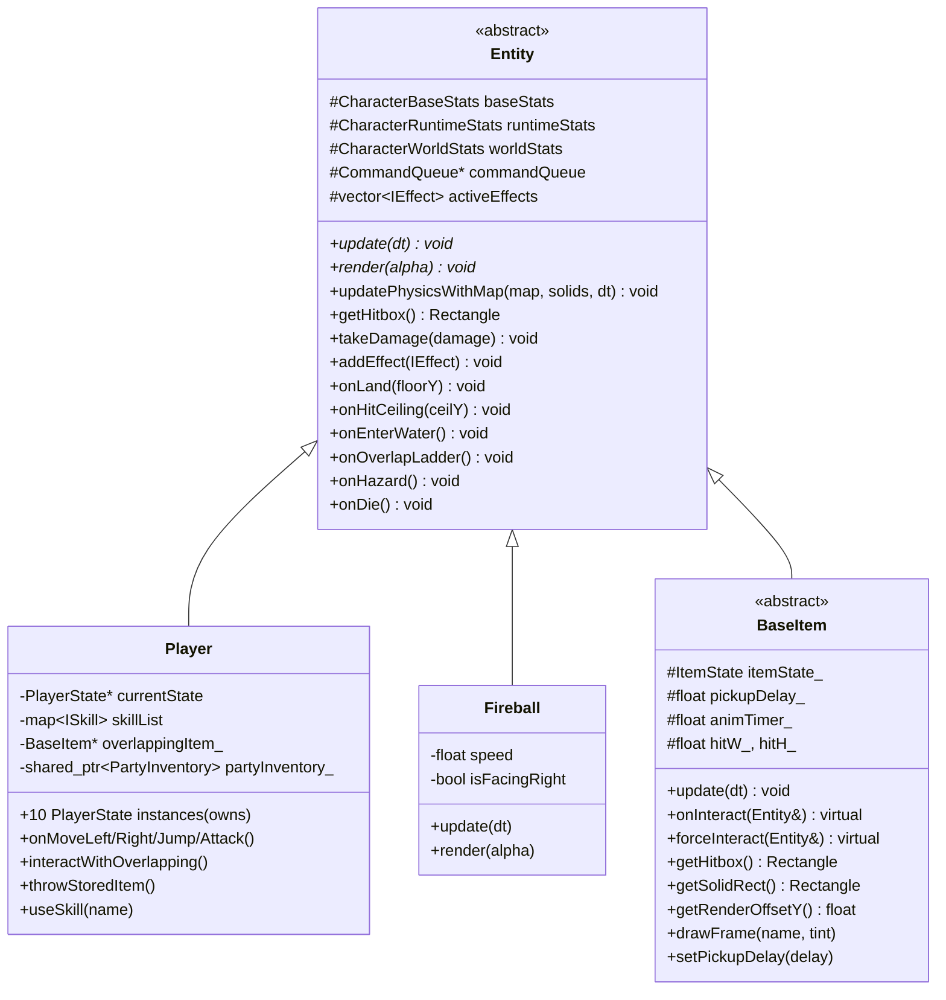
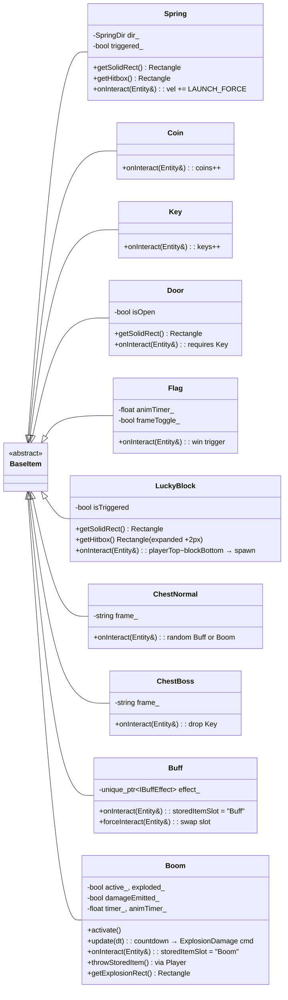
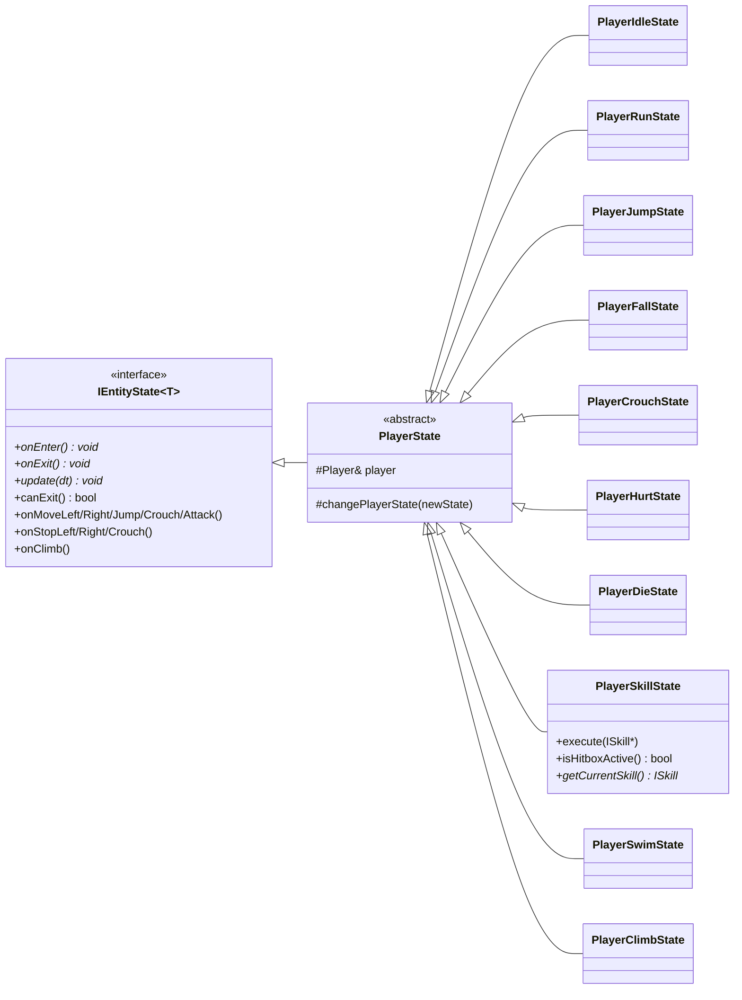
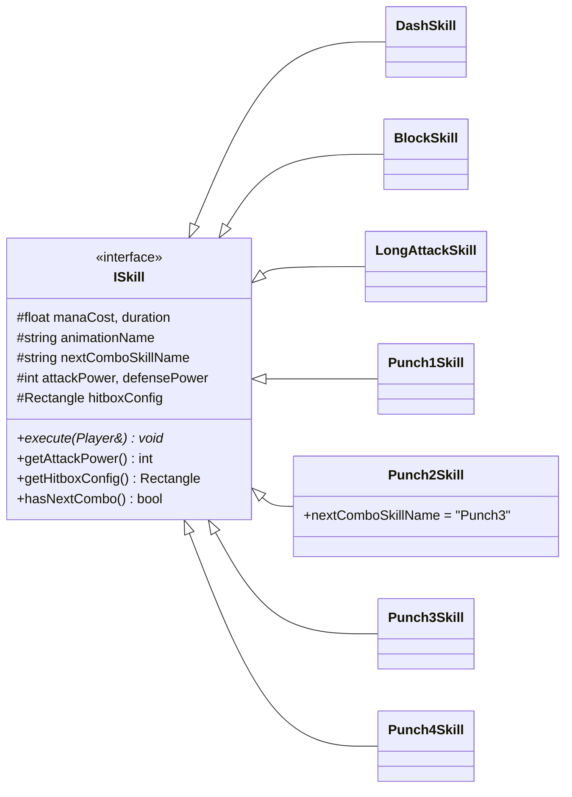
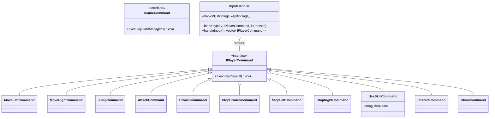
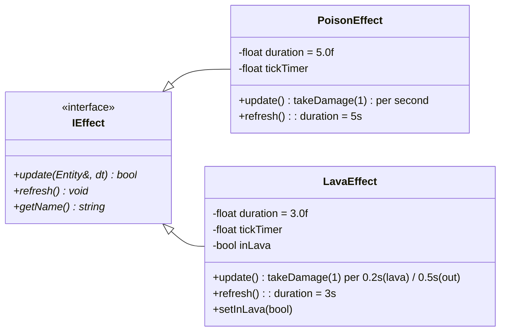
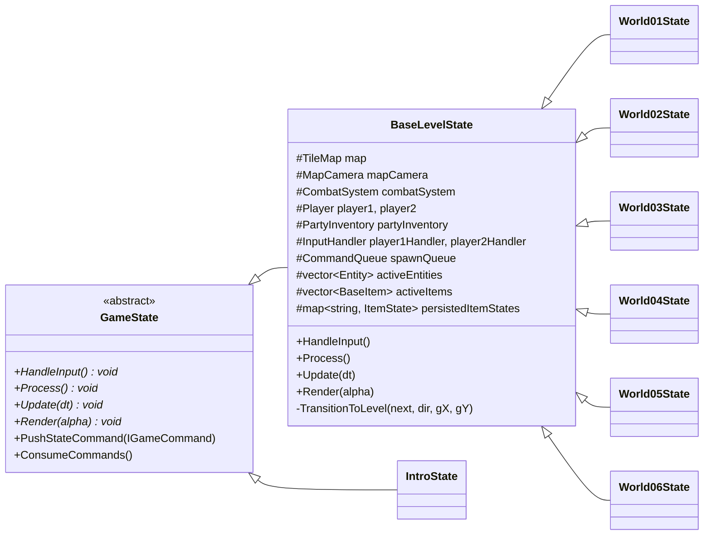
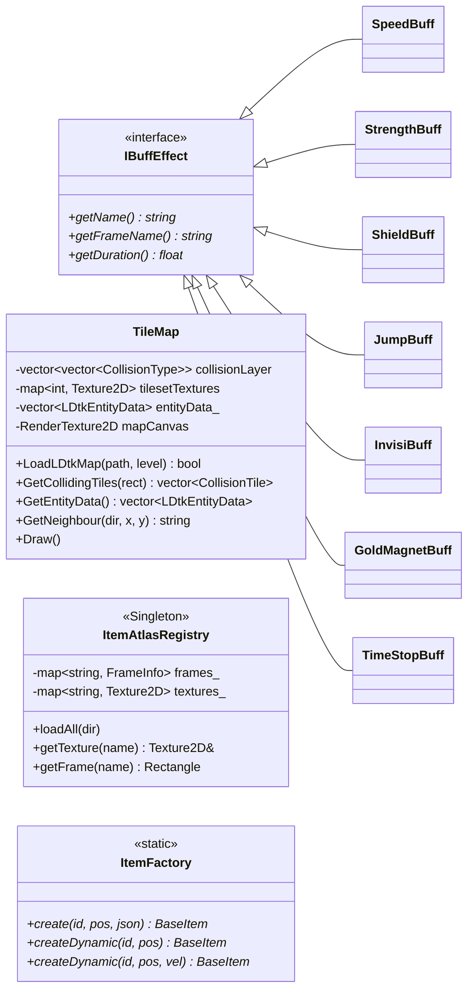

# Blueprint 1: Class Hierarchy & Composition

Sơ đồ kế thừa (inheritance) và sở hữu (composition/aggregation) của toàn bộ class trong dự án.

---

## 1. Entity Hierarchy

---

## 2. Item Subclasses

---

## 3. Player State Machine

---

## 4. Skill System

---

## 5. Command Pattern

---

## 6. Effects System

---

## 7. Game State Hierarchy

**`BaseLevelState`** là lớp cốt lõi nhất đại diện cho một màn chơi đang hoạt động. Nó nắm giữ (composition) toàn bộ hệ thống (TileMap, MapCamera, CombatSystem), các thực thể (Players, Items, Enemies), và hàng đợi (CommandQueue). Nó đóng vai trò là Orchestrator chạy vòng lặp 4 bước (Input -> Process -> Update -> Render).

---

## 8. Infrastructure — TileMap & Buff

**`TileMap`** là trung tâm nạp và lưu trữ dữ liệu bản đồ. Khi được gọi `LoadLDtkMap`, nó sẽ parse tệp LDtk (.json) để tạo mảng lưới va chạm (`collisionLayer`), các điểm sinh quái/vật phẩm (`entityData_`), và vẽ trước (bake) toàn bộ cảnh vật tĩnh lên một bảng vẽ (`mapCanvas` RenderTexture) để tối ưu hiệu suất Render.

