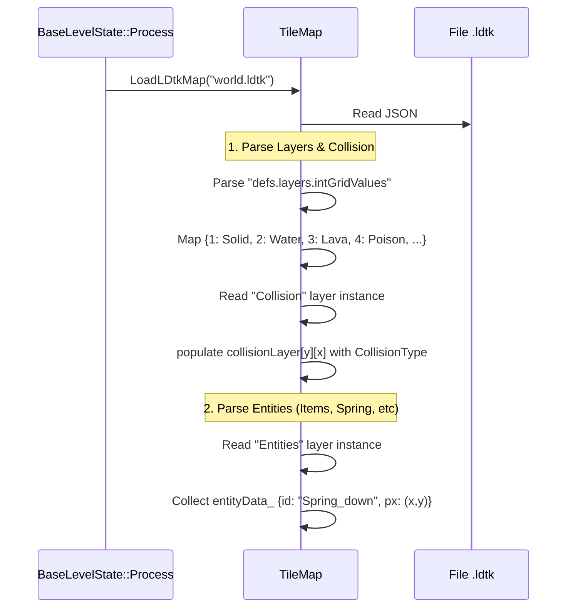
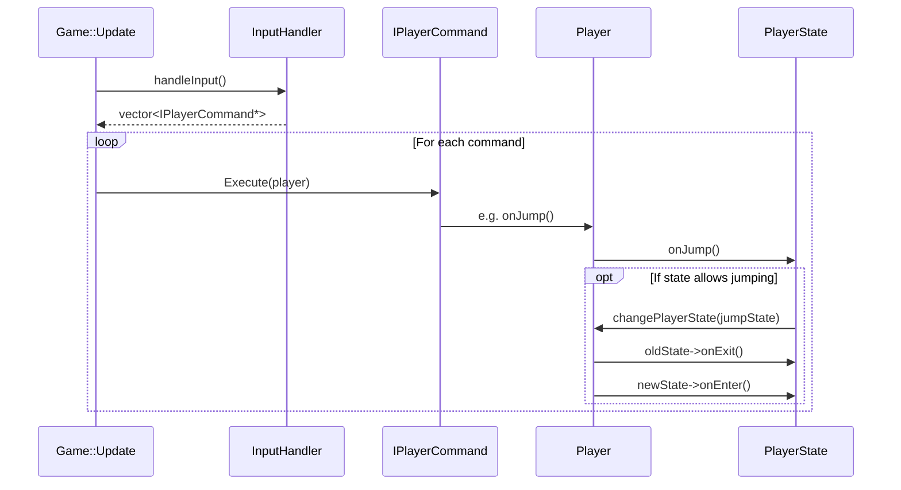
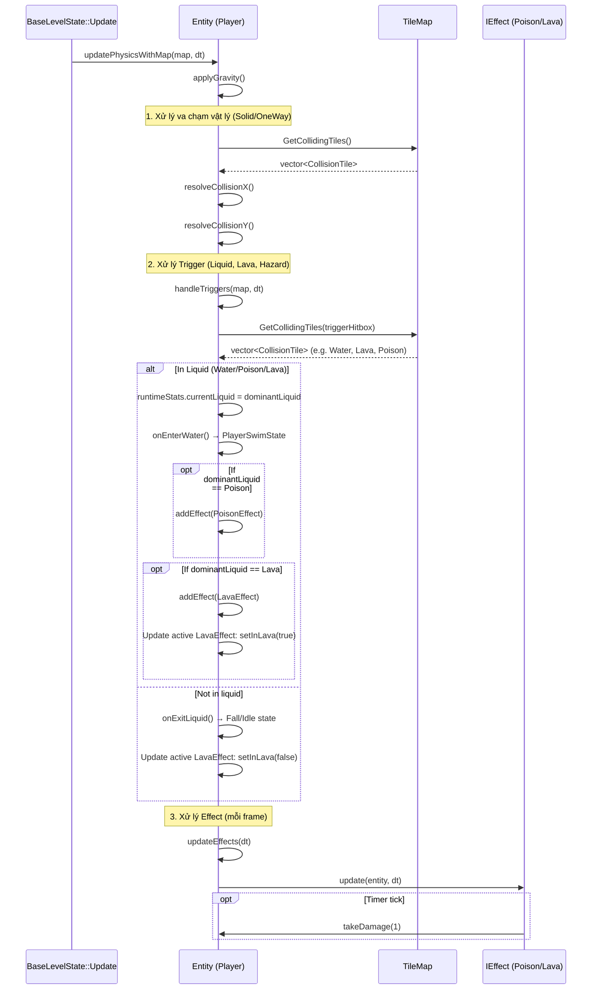
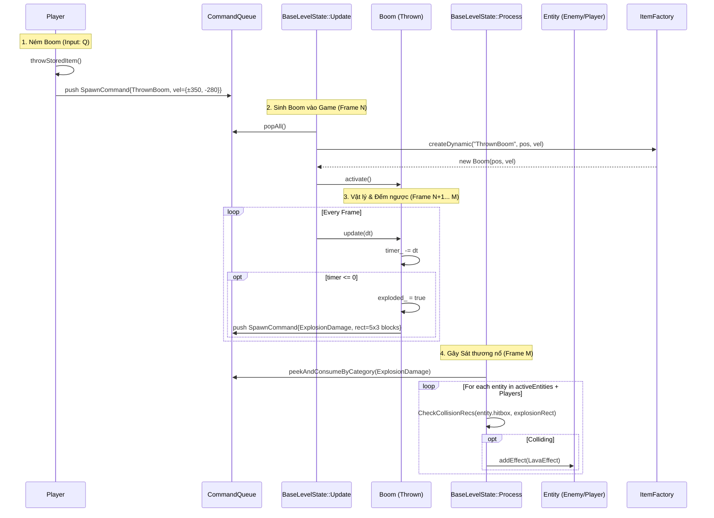

# Blueprint 2: Function Interaction & Command Patterns

Tài liệu này mô tả các sequence diagram và flow diagram cho các tương tác phức tạp giữa Player, Map, Item và các cơ chế vật lý (nước, lava, poison).

### Phân vai tương tác (Roles)
- **`BaseLevelState`**: Nơi khởi nguồn các tương tác. Nó điều khiển vòng lặp Update/Process, trực tiếp quét va chạm giữa các vật thể, đưa ra quyết định dựa trên Command, và chứa tất cả đối tượng tham gia tương tác.
- **`TileMap`**: Kho lưu trữ thông tin không gian. Nó được hỏi liên tục mỗi khi một Entity di chuyển để trả lời câu hỏi *"Tại toạ độ này, có gặp vật thể rắn, nước, dung nham hay không?"* (`GetCollidingTiles`).

---

## 1. Map Collision & Liquid Parsing (LDtk → TileMap)

Cách mà code lấy được thông số các block rắn, lỏng từ LDtk và lưu vào TileMap:



---

## 2. Input → Command → Player Action

Luồng xử lý từ khi người chơi bấm phím đến khi Player thực hiện hành động (đổi State).



---

## 3. Physics & Environment Interaction (Liquid, Lava, Poison)

Cách Player xử lý va chạm với môi trường (rắn, lỏng, độc, lửa) mỗi frame.



---

## 4. Item Interaction Flow (Spring, Coins, Chests, LuckyBlock)

Khi Player va chạm với các item, cách các hàm được gọi.

```mermaid
sequenceDiagram
    participant Update as BaseLevelState::Update
    participant Player
    participant Item as BaseItem (Spring/Coin/LuckyBlock)
    participant Factory as ItemFactory
    participant Queue as CommandQueue
    
    Update->>Update: Check Player Hitbox intersects Item Hitbox
    Update->>Item: onInteract(player)
    
    alt Spring
        Item->>Player: vel.y = -LAUNCH_FORCE
        Item->>Item: triggered = true, play animation
        
    else Coin / Key
        Item->>Item: itemState = Used
        Item->>Player: partyInventory.coins++
        
    else ChestNormal / ChestBoss
        Item->>Item: if Idle → set Used, play 50% alpha frame
        Item->>Queue: push SpawnCommand{Buff/Boom/Key, pos}
        
    else LuckyBlock
        Item->>Item: check if player is jumping up from below
        opt Player hit bottom of block
            Item->>Item: isTriggered = true (solid block changes to empty/used)
            Item->>Queue: push SpawnCommand{Coin/Buff/Boom, pos}
            Item->>Player: vel.y = 0 (bonk head)
        end
        
    else Buff / Boom (Pickup)
        opt Inventory Slot is Empty
            Item->>Item: itemState = Used
            Item->>Player: storedItemSlot = "Boom"
        else Inventory Slot is Full
            Item->>Player: setOverlappingItem(this) (waits for Q to swap)
        end
    end
    
    Note over Update: Xử lý Spawn Item từ rương/block
    Update->>Queue: popAll()
    Queue-->>Update: vector<SpawnCommand>
    Update->>Factory: createDynamic(cmd)
    Factory-->>Update: new Item added to activeItems
```

---

## 5. Throw Boom & Explosion Pattern

Mô tả cơ chế ném vật phẩm và hàng đợi Command (Event-like) cho vùng sát thương (ExplosionDamage).


