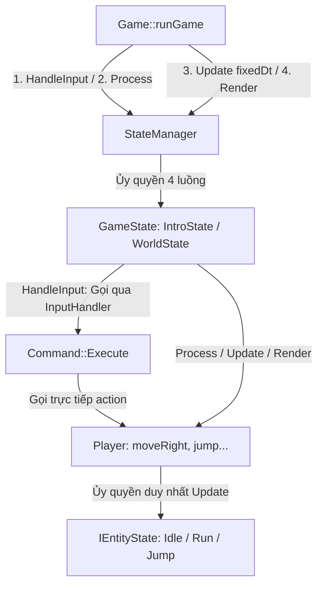
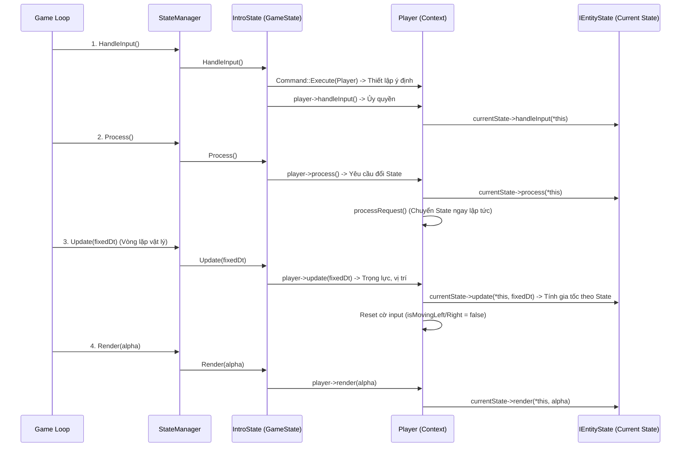

# Báo Cáo Kiểm Tra & Thẩm Định Kiến Trúc OOP: Luồng 4 Pha & Hệ Thống Player

Tài liệu này thẩm định chi tiết kiến trúc hiện tại của dự án **SuperMarioPlus**, tập trung vào đường ống xử lý 4 pha (`HandleInput` ➔ `Process` ➔ `Update` ➔ `Render`) và cách các đối tượng `Player`, `StateManager`, `GameState`, `InputHandler`, `IEntityState` tương tác với nhau theo các Design Pattern (Command, State, Game Loop).

---

## 1. Bức Tranh Toàn Cảnh (Overview & Pipeline Flow)

Hiện tại, luồng chính của game được điều hướng từ trên xuống dưới theo mô hình phân tầng:



### Điểm đứt gãy nghiêm trọng nhất hiện tại:
* Tại tầng `GameState` (`IntroState`), luồng `HandleInput` **không hề gọi** `entity->handleInput()`. 
* Hệ thống chỉ gọi `controller.handler.handleInput()` để lấy ra các `Command` rồi chạy `cmd->Execute(*(controller.target))`.
* **Hệ quả:** Hàm `Player::handleInput()` biến thành **Dead Code (Code chết)**. Mọi logic bạn viết vào đây đều bị chương trình ngó lơ 100%.

---

## 2. Phân Tích 5 Bất Cập Lớn Vi Phạm OOP & Design Pattern

### 🔴 Bất Cập 1: Đứt Gãy Luồng `handleInput` Tại Tầng GameState (Dead Code)
* **Vấn đề:** Trong file [IntroState.cpp](file:///d:/Git/.SuperMarioPlus/src/states/IntroState.cpp#L51-L60):
  ```cpp
  void IntroState::HandleInput() {
    for (auto &controller : controllers) {
      if (controller.target) {
        auto commands = controller.handler.handleInput(); // Đọc bàn phím -> ra Command
        for (auto *cmd : commands) {
          cmd->Execute(*(controller.target)); // Thực thi luôn Command lên Player
        }
        // ❌ HOÀN TOÀN THIẾU: controller.target->handleInput();
      }
    }
  }
  ```
* **Vi phạm OOP:** Vi phạm tính nhất quán của đường ống 4 pha (Pipeline Consistency). Khi class cơ sở `Entity` khai báo `virtual void handleInput()`, người thiết kế kỳ vọng nó phải được thực thi ở luồng 1, nhưng thực tế bị đoạn tuyệt hoàn toàn.

---

### 🔴 Bất Cập 2: Xung Đột Nhịp Tim Giữa `Process()` (Visual) và `Update()` (Physics Timestep)
* **Vấn đề:** Trong [Game.cpp](file:///d:/Git/.SuperMarioPlus/src/core/Game.cpp#L11-L21), 2 luồng `HandleInput()` và `Process()` chạy theo nhịp vẽ màn hình (FPS tùy biến: 60, 144, 240Hz), trong khi `Update(fixedDt)` chạy trong vòng lặp `while(accumulator >= fixedDt)` theo nhịp vật lý cố định (60Hz).
* **Hệ quả gây lỗi di chuyển:** Khi bạn đặt `isMovingLeft = false; isMovingRight = false;` trong `Player::process()`:
  * Ở màn hình 144Hz: Có những frame `Process()` chạy xóa cờ đi, nhưng `Update()` chưa kịp chạy -> Frame sau `Update` chạy thì cờ đã bằng `false` -> **Nhân vật đứng im không chạy được!**
  * Ở màn hình bị tụt FPS (30Hz): 1 lần `Process()` chạy thì `Update()` chạy 2 lần liên tiếp -> Lần 1 nhận được cờ, lần 2 bị mất cờ!
* **Vi phạm OOP:** Lỗi ghép nối chặt (Tight Coupling) giữa logic xử lý sự kiện (Process) và logic tính toán vật lý (Update).

---

### 🔴 Bất Cập 3: Sự Khập Khiễng Của State Pattern (`IEntityState` Bị Thiếu Luồng)
* **Vấn đề:** Hệ thống chính đi theo 4 pha, nhưng interface [IEntityState.h](file:///d:/Git/.SuperMarioPlus/include/entity/IEntityState.h#L3-L13) của bạn hiện tại chỉ có:
  ```cpp
  class IEntityState {
      virtual void update(T& entity, float dt) = 0; // Chỉ có mỗi Update!
      virtual void onEnter(T& entity) = 0;
      // ❌ HOÀN TOÀN THIẾU: handleInput, process, render!
  };
  ```
* **Vi phạm OOP:** Trong chuẩn State Pattern (GoF), Context (`Player`) phải ủy quyền (delegate) hành vi cho `State` hiện tại. Hiện tại bạn ủy quyền `update(dt)` cho State, nhưng `process()` và `render()` thì `Player` lại đang tự làm cứng (hardcoded)!
  * *Ví dụ vi phạm:* Trong `Player::process()`, bạn đang viết cố định `if (!isMovingLeft && !isMovingRight) stopMove();`. Nếu Mario đang ở `JumpState` (đang bay trên trời), việc buông tay phím đâu có nghĩa là được chuyển về `IdleState` (đứng đất)? Logic dừng lại này đáng lẽ chỉ được phép tồn tại trong `PlayerRunState`!

---

### 🔴 Bất Cập 4: Vi phạm Nguyên Tắc Mở/Đóng (Open/Closed Principle - OCP)
* **Vấn đề:** Trong `Player::update(dt)`, bạn đang viết một khối `if (isMovingRight) ... else if (isMovingLeft) ... else` rất dài để tính gia tốc, ma sát và vận tốc.
* **Vi phạm OOP:** Sau này khi dự án mở rộng, bạn thêm các trạng thái: `IceSkateState` (trượt băng - ma sát bằng 0), `WaterState` (bơi dưới nước - gia tốc chậm, lực nổi), `ClimbState` (leo cây leo thang - không có trọng lực y)... bạn sẽ phải chui vào `Player::update` để thêm hàng tá câu lệnh `if (currentState == ...)` -> Class `Player` sẽ biến thành một **God Object (Đối tượng quái vật)** tháo dỡ rất khổ.

---

### 🔴 Bất Cập 5: Độ Trễ Chuyển Đổi Trạng Thái (1-Frame Delay in State Transition)
* **Vấn đề:** Ở `Player::update(dt)`, bạn gọi `processRequest();` ngay đầu hàm. Nhưng ở `Player::process()`, bạn lại gọi `stopMove()`, trong đó `PlayerRunState::onStopMove` gọi `player.setRequest(player.getIdleState());`. Điều này tạo ra độ trễ 1 frame giữa lúc buông phím và lúc đổi animation/state vật lý thực sự.

---

## 3. Bản Thiết Kế Chuẩn Mực OOP (Proposed Clean Architecture)

Sơ đồ ủy quyền 4 luồng chuẩn mực (Clean 4-Phase Delegation Pipeline):



### Bảng định nghĩa nhiệm vụ chuẩn mực của 4 Luồng:

| Luồng | Tần suất chạy | Nhiệm vụ chuẩn mực OOP | Tuyệt đối không làm |
| :--- | :--- | :--- | :--- |
| **1. HandleInput** | Theo nhịp vẽ (FPS) | Đọc phím/chuột ➔ Gửi Command vào Entity ➔ Gọi `entity->handleInput()`. | Không tính toán vật lý, không đổi vị trí (`position`). |
| **2. Process** | Theo nhịp vẽ (FPS) | **Xử lý sự kiện & Đổi State (State Transition):** Nhận sát thương, va chạm event, ăn nấm đổi size, chết, kích hoạt skill. Gọi `processRequest()` ở cuối. | **Không reset cờ input vật lý**, không can thiệp `velocity`. |
| **3. Update** | Cố định (`fixedDt`) | **Động lực học & Vật lý:** Tính gia tốc, ma sát, trọng lực, cập nhật vị trí (`position`). **Reset cờ input ở cuối pha này.** | Không đọc phím bàn phím trực tiếp. |
| **4. Render** | Theo nhịp vẽ (FPS) | Chỉ tính toán hình ảnh, animation và vẽ ra màn hình theo nội suy `alpha`. | Không sửa đổi bất kỳ biến logic hay vật lý nào (chỉ `const`). |

---

## 4. Kế Hoạch Tái Cấu Trúc Chi Tiết (Refactor Roadmap)

### Bước 1: Nâng cấp `IEntityState` lên đầy đủ 4 luồng
Sửa file [include/entity/IEntityState.h](file:///d:/Git/.SuperMarioPlus/include/entity/IEntityState.h) để State nhận toàn bộ trách nhiệm từ Context:

```cpp
#pragma once

template <typename T>
class IEntityState {
public:
    virtual ~IEntityState() = default;

    // 4 pha ủy quyền (Delegation pipeline)
    virtual void handleInput(T& entity) {}
    virtual void process(T& entity) {}
    virtual void update(T& entity, float dt) = 0;
    virtual void render(const T& entity, float alpha) const {}

    // Các event transitions
    virtual void onJump(T& entity) {}
    virtual void onMoveRight(T& entity) {}
    virtual void onMoveLeft(T& entity) {}
    virtual void onStopMove(T& entity) {}
    virtual void onEnter(T& entity) = 0;
};
```

---

### Bước 2: Nối lại điểm đứt gãy trong `IntroState::HandleInput()`
Sửa file [src/states/IntroState.cpp](file:///d:/Git/.SuperMarioPlus/src/states/IntroState.cpp#L51-L60):

```cpp
void IntroState::HandleInput() {
  for (auto &controller : controllers) {
    if (controller.target) {
      // 1. Thực thi các lệnh Command (bật cờ di chuyển/nhảy)
      auto commands = controller.handler.handleInput();
      for (auto *cmd : commands) {
        cmd->Execute(*(controller.target));
      }
      // 2. GỌI BỔ SUNG: Cho phép Entity xử lý input của riêng nó!
      controller.target->handleInput();
    }
  }
}
```

---

### Bước 3: Chuẩn hóa class `Player` theo nguyên tắc Đa Hình (Polymorphism)
Trong file [src/entity/Player/Player.cpp](file:///d:/Git/.SuperMarioPlus/src/entity/Player/Player.cpp), sửa 4 luồng chính chỉ còn nhiệm vụ ủy quyền và làm vật lý chung:

```cpp
void Player::handleInput() { 
    if (currentState) currentState->handleInput(*this); 
}

void Player::process() { 
    if (currentState) currentState->process(*this);
    
    // Gọi chuyển state ngay tại khâu Process để chuẩn bị cho Update vật lý
    processRequest(); 
}

void Player::update(float dt) {
    if (currentState) currentState->update(*this, dt);
    currentAnimation->update(dt);
    skillManager.update(dt);

    // 1. Tính trọng lực (Quy luật vật lý chung cho mọi state)
    velocity.y += stats.gravityScale * 1000.0f * dt;

    // 2. Cập nhật vị trí
    prevPosition = position;
    position.x += dt * velocity.x;
    position.y += dt * velocity.y;

    // 3. Kiểm tra chạm đất cơ bản (sau này thay bằng Collision System)
    if (position.y > 500) {
        isGrounded = true;
        position.y = 500;
        velocity.y = 0;
    } else {
        isGrounded = false;
    }

    // 4. RESET CỜ INPUT Ở CUỐI PHA VẬT LÝ
    isMovingLeft = false;
    isMovingRight = false;
}

void Player::render(float alpha) const {
    if (currentState) {
        currentState->render(*this, alpha);
    } else {
        // Fallback render mặc định nếu State không tự vẽ
        Rectangle rec = currentAnimation->getCurrentFrame();
        if (!isFacingRight) {
            rec.x += rec.width;
            rec.width = -rec.width;
        }
        Vector2 renderPos = {prevPosition.x + (position.x - prevPosition.x) * alpha,
                             prevPosition.y + (position.y - prevPosition.y) * alpha};
        DrawTextureRec(currentAnimation->getTexture(), rec, renderPos, WHITE);
    }
}
```

---

### Bước 4: Di dời Vật Lý và chuyển State vào từng Class State (State-Driven Physics)
Sửa file [src/entity/Player/PlayerStates.cpp](file:///d:/Git/.SuperMarioPlus/src/entity/Player/PlayerStates.cpp) để từng State tự quyết định cách chuyển động:

#### 1. `PlayerIdleState` (Đứng im dưới đất):
```cpp
void PlayerIdleState::process(Player& player) {
    // Đang Idle mà có lệnh chạy -> Yêu cầu đổi sang RunState
    if (player.getIsMovingLeft() || player.getIsMovingRight()) {
        player.setRequest(player.getRunState());
    }
}

void PlayerIdleState::update(Player& player, float dt) {
    // Đứng im: Áp dụng ma sát đất để giảm velocity.x về 0
    float friction = 1500.0f;
    float velX = player.getVelocity().x;
    
    if (velX > 0) {
        velX -= friction * dt;
        if (velX < 0) velX = 0;
    } else if (velX < 0) {
        velX += friction * dt;
        if (velX > 0) velX = 0;
    }
    player.setVelocityX(velX);
}
```

#### 2. `PlayerRunState` (Đang chạy dưới đất):
```cpp
void PlayerRunState::process(Player& player) {
    // Đang chạy mà buông cả 2 phím -> Yêu cầu đổi về IdleState
    if (!player.getIsMovingLeft() && !player.getIsMovingRight()) {
        player.setRequest(player.getIdleState());
    }
}

void PlayerRunState::update(Player& player, float dt) {
    // 1. Sử dụng hướng tổng hợp (Axis) để giải quyết xung đột khi bấm 2 phím cùng lúc
    int moveDir = 0;
    if (player.getIsMovingRight()) moveDir += 1;
    if (player.getIsMovingLeft()) moveDir -= 1;

    float accX = player.getStats().acceleration;
    float maxSpeed = player.getStats().maxSpeed;
    float friction = 1500.0f;
    float velX = player.getVelocity().x;

    // 2. Tính toán gia tốc theo hướng chạy
    if (moveDir > 0) {
        player.setFaceDirection(true);
        if (velX < 0) {
            velX += friction * 2.0f * dt; // Phanh gấp khi đổi hướng
            if (velX > 0) velX = 0;
        } else if (velX < maxSpeed) {
            velX += accX * dt;
            if (velX > maxSpeed) velX = maxSpeed;
        }
    } else if (moveDir < 0) {
        player.setFaceDirection(false);
        if (velX > 0) {
            velX -= friction * 2.0f * dt;
            if (velX < 0) velX = 0;
        } else if (velX > -maxSpeed) {
            velX -= accX * dt;
            if (velX < -maxSpeed) velX = -maxSpeed;
        }
    } else {
        // Bấm cả 2 phím triệt tiêu -> giảm ma sát
        if (velX > 0) { velX -= friction * dt; if (velX < 0) velX = 0; }
        else if (velX < 0) { velX += friction * dt; if (velX > 0) velX = 0; }
    }

    player.setVelocityX(velX);
}
```

#### 3. `PlayerJumpState` (Đang nhảy / Bay trên không):
```cpp
void PlayerJumpState::process(Player& player) {
    // Trên không không tự động về Idle kể cả khi buông phím chạy!
}

void PlayerJumpState::update(Player& player, float dt) {
    // Khi chạm đất -> Chuyển về Idle hoặc Run tùy input lúc tiếp đất
    if (player.checkIsGrounded()) {
        if (player.getIsMovingLeft() || player.getIsMovingRight()) {
            player.setRequest(player.getRunState());
        } else {
            player.setRequest(player.getIdleState());
        }
        return;
    }

    // Air Control: Di chuyển trên không (gia tốc yếu hơn dưới đất, ví dụ 50%)
    int moveDir = 0;
    if (player.getIsMovingRight()) moveDir += 1;
    if (player.getIsMovingLeft()) moveDir -= 1;

    float airAccX = player.getStats().acceleration * 0.5f;
    float maxSpeed = player.getStats().maxSpeed;
    float velX = player.getVelocity().x;

    if (moveDir > 0) {
        player.setFaceDirection(true);
        if (velX < maxSpeed) { velX += airAccX * dt; if (velX > maxSpeed) velX = maxSpeed; }
    } else if (moveDir < 0) {
        player.setFaceDirection(false);
        if (velX > -maxSpeed) { velX -= airAccX * dt; if (velX < -maxSpeed) velX = -maxSpeed; }
    }

    player.setVelocityX(velX);
}
```

---
## 🎯 Tổng Kết Lợi Ích Của Kiến Trúc Mới
1. **Hoàn toàn hết lỗi đi mãi / không đổi hướng:** Cờ input được reset đúng lúc tại điểm cuối vòng lặp vật lý `Update(dt)`, đảm bảo đồng bộ hoàn hảo với Fixed Timestep.
2. **Khắc phục Dead Code:** Nối liền mạch luồng `handleInput` từ trên xuống dưới.
3. **Mở rộng cực kỳ dễ dàng (OCP):** Khi thêm trạng thái Bơi, Trượt Băng, Leo Thang... bạn chỉ cần tạo class State mới và viết hàm `update()` cho nó, không bao giờ phải sửa lại class `Player` nữa!
