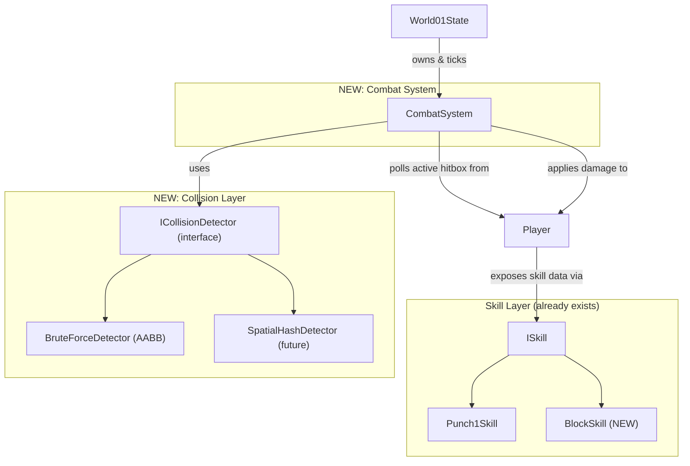

# Skill Hitbox & Damage System (AABB → Spatial Hash Ready)

## Goal
Make attack skills (Punch1–4, Jump_attack, etc.) produce **hitboxes** that deal damage, and make Block produce a **defense box** that reduces/absorbs damage. Start simple with brute-force AABB checks, but architect so swapping to Spatial Hash later is a one-file change.

## Key Design Decision: One-Way Dependency

```
CombatSystem → knows Players (one-way, observes)
Players → don't know CombatSystem exists
```

The CombatSystem **polls** each player every frame to ask "are you attacking/blocking? what's the hitbox?". Players just **expose data** — they never push hitboxes or call back into CombatSystem.

## Architecture Overview



**Data flow each frame:**
1. `CombatSystem::update(dt)` iterates registered players
2. For each player in skill state → reads `getActiveHitbox()` (returns world-space rect + attack/defense values)
3. Runs collision detection (attack hitboxes vs other players' physics boxes)
4. Applies damage (reduced by any active block)

---

## Proposed Changes

### Component 0: Cleanup — Remove Unused Fields from CharacterStats

#### [MODIFY] [CharacterStats.h](file:///d:/super_mario/Super_Mario_Plus/include/entity/Player/CharacterStats.h)

Remove fields that are now per-skill (stored in `ISkill` instead):

```diff
 struct CharacterBaseStats {
     std::string name = "Default";
     int maxHealth = 100;
     int maxMana = 100;
     float moveVelocity = 100.0f;
     float jumpVelocity = 100.0f;
     float gravityScale = 10.0f;
     Vector2 physicsBox = {0.0f, 0.0f};
     Vector2 crouchBox = {0.0f, 0.0f};
-    Vector2 attackBox = {0.0f, 0.0f};
 };

 struct CharacterRuntimeStats {
     int health = 100;
     int mana   = 0;
-    int attack = 0;
-    int defense = 0;
     Vector2 physicsBox = {0.0f, 0.0f};
-    Vector2 attackBox = {0.0f, 0.0f};
     Vector2 velocity = {0.0f, 0.0f};
     bool isGrounded = false;
 };
```

> These fields are declared but **never read** anywhere in the codebase. Each skill now owns its own `attackPower`, `defensePower`, and `hitboxConfig`.

---

### Component 1: Hitbox Data Structure

#### [NEW] [Hitbox.h](file:///d:/super_mario/Super_Mario_Plus/include/entity/Hitbox.h)

A lightweight POD struct representing an active hitbox in the world:

```cpp
#pragma once
#include "raylib.h"

class Player;

struct Hitbox {
    Rectangle rect;         // world-space AABB
    int damage = 0;         // attack power (0 for block hitboxes)
    int defense = 0;        // damage reduction (0 for attack hitboxes)
    Player* owner = nullptr;
};
```

---

### Component 2: Collision Detection (Strategy Pattern)

#### [NEW] [ICollisionDetector.h](file:///d:/super_mario/Super_Mario_Plus/include/core/ICollisionDetector.h)

```cpp
#pragma once
#include "Hitbox.h"
#include <vector>

struct CollisionPair {
    const Hitbox* hitbox;
    Player* target;
};

class ICollisionDetector {
public:
    virtual ~ICollisionDetector() = default;
    virtual std::vector<CollisionPair> detect(
        const std::vector<Hitbox>& hitboxes,
        const std::vector<Player*>& entities
    ) = 0;
};
```

#### [NEW] [BruteForceDetector.h](file:///d:/super_mario/Super_Mario_Plus/include/core/BruteForceDetector.h)
#### [NEW] [BruteForceDetector.cpp](file:///d:/super_mario/Super_Mario_Plus/src/core/BruteForceDetector.cpp)

Simple O(n×m) loop using Raylib's `CheckCollisionRecs()`:

```cpp
std::vector<CollisionPair> BruteForceDetector::detect(
    const std::vector<Hitbox>& hitboxes,
    const std::vector<Player*>& entities
) {
    std::vector<CollisionPair> results;
    for (auto& hb : hitboxes) {
        for (auto* player : entities) {
            if (player == hb.owner) continue;  // no self-hit
            if (CheckCollisionRecs(hb.rect, player->getHitbox())) {
                results.push_back({&hb, player});
            }
        }
    }
    return results;
}
```

> [!TIP]
> **Future upgrade**: Create `SpatialHashDetector` implementing the same `ICollisionDetector` interface. Swap one line in `CombatSystem` constructor. Zero other files change.

---

### Component 3: CombatSystem (Observer / Orchestrator)

#### [NEW] [CombatSystem.h](file:///d:/super_mario/Super_Mario_Plus/include/core/CombatSystem.h)
#### [NEW] [CombatSystem.cpp](file:///d:/super_mario/Super_Mario_Plus/src/core/CombatSystem.cpp)

Owned by `World01State`. Holds player references registered once at startup. **Players never reference this class.**

```cpp
class CombatSystem {
    std::vector<Player*> players;
    std::unique_ptr<ICollisionDetector> detector;  // ← swap for Spatial Hash
public:
    CombatSystem();
    void registerPlayer(Player* p);
    void update(float dt);
    void renderDebug() const;
};
```

**`update(dt)` logic:**
```
1. Collect active hitboxes:
   for each player:
       if player->hasActiveHitbox() → append player->getActiveHitbox()

2. Run collision detection:
   pairs = detector->detect(hitboxes, players)

3. Resolve damage:
   for each (attackHitbox, targetPlayer) pair:
       if attackHitbox.damage == 0 → skip (it's a block box, not an attack)
       // Check if target is blocking
       if target->hasActiveHitbox():
           targetHitbox = target->getActiveHitbox()
           if targetHitbox.defense > 0:
               finalDamage = max(0, attackHitbox.damage - targetHitbox.defense)
       if finalDamage > 0 → targetPlayer->takeDamage(finalDamage)
```

---

### Component 4: Player Exposes Hitbox Data (Read-Only)

#### [MODIFY] [Player.h](file:///d:/super_mario/Super_Mario_Plus/include/entity/Player/Player.h)

Add methods for CombatSystem to **read** (no back-reference needed):

```cpp
// Combat — read-only queries for CombatSystem
bool hasActiveHitbox() const;
Hitbox getActiveHitbox() const;
void takeDamage(int damage);
```

#### [MODIFY] [Player.cpp](file:///d:/super_mario/Super_Mario_Plus/src/entity/Player/Player.cpp)

```cpp
bool Player::hasActiveHitbox() const {
    return currentState == &skillState && skillState.getCurrentSkill() != nullptr;
}

Hitbox Player::getActiveHitbox() const {
    const ISkill* skill = skillState.getCurrentSkill();
    Rectangle box = skill->getHitboxConfig();
    // Compute world-space rect based on position + facing direction
    float offsetX = worldStats.isFacingRight ? box.x : -(box.x + box.width);
    Rectangle worldRect = {
        worldStats.position.x + offsetX - box.width / 2.0f,
        worldStats.position.y - runtimeStats.physicsBox.y + box.y,
        box.width,
        box.height
    };
    return { worldRect, skill->getAttackPower(), skill->getDefensePower(), this };
}

void Player::takeDamage(int damage) {
    runtimeStats.health -= damage;
    if (runtimeStats.health <= 0) {
        runtimeStats.health = 0;
        changeState(dieState);
    } else {
        changeState(hurtState);
    }
}
```

---

### Component 5: Skill Changes

#### [MODIFY] [ISkill.h](file:///d:/super_mario/Super_Mario_Plus/include/entity/Skill/ISkill.h)

Add combat data fields (loaded from JSON by factory):

```cpp
class ISkill {
protected:
    // ... existing fields ...

    // NEW: Combat data
    int attackPower = 0;
    int defensePower = 0;
    Rectangle hitboxConfig = {0, 0, 0, 0};  // {offsetX, offsetY, w, h}
public:
    // ... existing methods ...

    // NEW: getters + setter
    int getAttackPower() const { return attackPower; }
    int getDefensePower() const { return defensePower; }
    Rectangle getHitboxConfig() const { return hitboxConfig; }
    void setCombatData(int atk, int def, Rectangle box);
};
```

#### [MODIFY] [PlayerSkillState.h](file:///d:/super_mario/Super_Mario_Plus/include/entity/Player/PlayerSkillState.h)

Expose the current skill for CombatSystem to read:

```cpp
// Add getter
const ISkill* getCurrentSkill() const { return currentSkill; }
```

#### [NEW] [BlockSkill.h](file:///d:/super_mario/Super_Mario_Plus/include/entity/Skill/BlockSkill.h)
#### [NEW] [BlockSkill.cpp](file:///d:/super_mario/Super_Mario_Plus/src/entity/Skill/BlockSkill.cpp)

```cpp
class BlockSkill : public ISkill {
public:
    BlockSkill(float mn = 0.0f, float dr = 0.5f) : ISkill(mn, dr) {
        animationName = "block";
    }
    void execute(Player& player) override;
};
```

`execute()` just stops movement (blocking = standing guard). The defense logic is handled entirely by CombatSystem reading the `defensePower` value.

#### Punch1–4 Skills

**No changes needed** to `execute()` — CombatSystem reads their `attackPower` and `hitboxConfig` externally.

---

### Component 6: World Integration

#### [MODIFY] [World01State.h](file:///d:/super_mario/Super_Mario_Plus/include/states/World01State.h)

Add `CombatSystem combatSystem;` member.

#### [MODIFY] [World01State.cpp](file:///d:/super_mario/Super_Mario_Plus/src/states/World01State.cpp)

```cpp
// Constructor — register once, one-way
combatSystem.registerPlayer(player1.get());
combatSystem.registerPlayer(player2.get());

// Update — CombatSystem polls players itself
void World01State::Update(float dt) {
    // ... existing physics & state updates ...
    combatSystem.update(dt);  // polls players, detects collisions, applies damage
}

// Render — debug visualization
void World01State::Render(float alpha) const {
    // ... existing rendering ...
    combatSystem.renderDebug();  // green = attack box, blue = defense box
}
```

---

### Component 7: Factory – Load Combat Data from JSON

#### [MODIFY] [PlayerFactory.cpp](file:///d:/super_mario/Super_Mario_Plus/src/entity/Player/PlayerFactory.cpp)

When creating each skill, read combat data from the existing JSON and inject it:

```cpp
// After creating the skill object:
auto& skillJson = charData["skills"][skillName];
int atk = skillJson.value("attack", 0);
int def = skillJson.value("defense", 0);
Rectangle box = {
    skillJson["box"].value("offsetX", 0.0f),
    skillJson["box"].value("offsetY", 0.0f),
    skillJson["box"]["w"].get<float>(),
    skillJson["box"]["h"].get<float>()
};
skill->setCombatData(atk, def, box);
```

Also add `BlockSkill` creation to the factory's skill-name lookup.

No JSON schema changes needed — `characters.json` already has all the data.

---

## Summary of All File Changes

### New Files (8)

| File | Purpose |
|------|---------|
| `include/entity/Hitbox.h` | Hitbox POD struct |
| `include/core/ICollisionDetector.h` | Collision detection interface |
| `include/core/BruteForceDetector.h` | AABB implementation header |
| `src/core/BruteForceDetector.cpp` | AABB implementation |
| `include/core/CombatSystem.h` | Combat orchestrator header |
| `src/core/CombatSystem.cpp` | Combat orchestrator |
| `include/entity/Skill/BlockSkill.h` | Block skill header |
| `src/entity/Skill/BlockSkill.cpp` | Block skill implementation |

### Modified Files (8)

| File | Change |
|------|--------|
| `CharacterStats.h` | Remove unused `attackBox`, `attack`, `defense` fields |
| `ISkill.h` | Add `attackPower`, `defensePower`, `hitboxConfig` fields + getters |
| `PlayerSkillState.h` | Add `getCurrentSkill()` getter |
| `Player.h` | Add `hasActiveHitbox()`, `getActiveHitbox()`, `takeDamage()` |
| `Player.cpp` | Implement the 3 new methods |
| `World01State.h/cpp` | Own `CombatSystem`, register players, call `update`/`renderDebug` |
| `PlayerFactory.cpp` | Load combat data from JSON, add BlockSkill creation |
| `CMakeLists.txt` | Add new `.cpp` files |

---

## Spatial Hash Upgrade Path

1. Create `SpatialHashDetector` implementing `ICollisionDetector`
2. In `CombatSystem` constructor, swap `make_unique<BruteForceDetector>()` → `make_unique<SpatialHashDetector>(cellSize)`
3. **Done.** No other files change.

---

## Verification Plan

### Build
```bash
cmake --build build --config Debug
```

### Manual Testing
- P1 punches near P2 → P2 health drops, enters hurt state
- P2 blocks then P1 punches → damage reduced by Block's defense value
- Punching air → no damage to anyone
- Self-hit impossible (owner is skipped)
- Debug rects visible: **green** = attack, **blue** = defense
