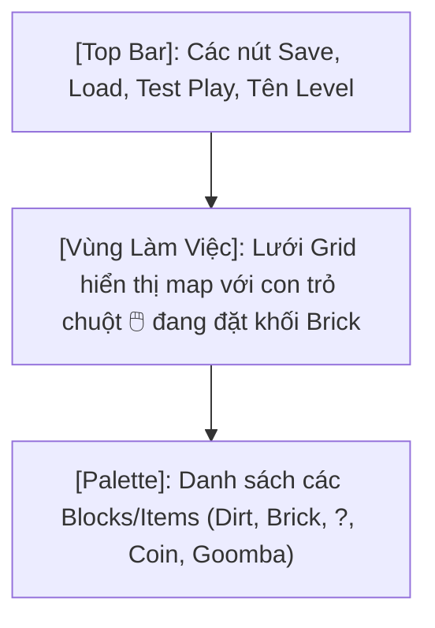

# Kết Quả Nghiên Cứu: Giải Pháp Cho Người Chơi Tự Thiết Kế Map Khởi Tạo (Không Cần LDtk)

## 1. Phân Tích Logic Hoạt Động Hiện Tại của LDtk (world03 -> world05 & BaseLevelState)

Sau khi duyệt qua mã nguồn của `BaseLevelState.cpp` và `TileMap.h` cùng với các file `world03.ldtk`, hệ thống game hiện tại đang tải map theo flow sau:

1. **Khởi tạo và Parsing**: `BaseLevelState` gọi `map.LoadLDtkMap(mapFilePath, currentLevel);`. Phương thức này trong `TileMap` sử dụng `nlohmann::json` để đọc file `.ldtk` khổng lồ (thường >1MB do chứa nhiều metadata của app LDtk).
2. **Xử lý Collision & Tiles**: `TileMap` quét qua các layer (ví dụ: `IntGridd`) để sinh ra `collisionLayer` (gồm các block Solid, Ladder, OneWay, v.v.).
3. **Player Spawns**: `map.GetPlayerSpawns()` lấy toạ độ spawn cho người chơi.
4. **Item & Entity Factory**: `map.GetEntityData()` trả về danh sách các `LDtkEntityData` (gồm identifier như `Coin`, `Flag`, tọa độ `px`). Sau đó `BaseLevelState` dùng `ItemFactory::create(...)` và `EntityFactory::create(...)` để sinh ra các object trong game.

> [!NOTE]
> **Vấn đề của LDtk với người chơi bình thường:** Cấu trúc JSON của LDtk quá phức tạp (nhiều UID, quy tắc lưới tự động, metadata app). Bắt người chơi mở app LDtk hoặc tự gõ file JSON này là **bất khả thi**.

---

## 2. Giải Pháp Đề Xuất

Để người chơi tự do tạo level mà không cần tải tool bên thứ 3, bạn có 2 hướng tiếp cận khả thi nhất:

### Hướng 1: Map định dạng Text/ASCII (Dành cho modder cơ bản)
Bạn có thể viết thêm một hàm `TileMap::LoadAsciiMap(string path)` đọc file `.txt`. Người chơi chỉ cần mở Notepad và gõ các ký tự đại diện cho khối (block).

**Visualize - File `custom_level.txt` của người chơi:**
```text
W 40
H 15
BACKGROUND clouds

========================================
=                                      =
=                                      =
=                                      =
=           C   ?   C                  =
=         -------------                =
=                                      =
=  P1                             E    =
========================================

LEGEND
= : SolidBlock
- : OneWayPlatform
? : MysteryBlock
C : Coin
P1: Player1Spawn
E : GoombaEntity
```
*Ưu điểm:* Cực kỳ dễ lập trình trong 1 buổi. Không cần UI phức tạp. Nhỏ gọn.
*Nhược điểm:* Khó hình dung kích thước thật của level, không trực quan bằng hình ảnh.

### Hướng 2: Xây dựng In-Game Level Editor (Khuyên dùng)
Game có thể cung cấp hẳn một "Chế Độ Sáng Tạo" (Maker Mode giống Super Mario Maker). Bạn cần tạo một `EditorState` kế thừa `GameState`. 

Trong State này, hệ thống physics không hoạt động. Người chơi có thể tự do dùng chuột (hoặc tay cầm) chọn khối và "sơn" (paint) lên màn hình.

**Visualize - Giao diện Editor trong game:**


**Mô phỏng màn hình trải nghiệm người chơi:**
````carousel
```text
+-------------------------------------------------------------+
| [Save Map]  [Load Map]  [▶ Play Test]      Current: [?] Box |
+-------------------------------------------------------------+
|                                                             |
|           🖱️(click để đặt ?)                                  |
|            ↓                                                |
|           [?]                                               |
|                                                  E          |
|  P1                                                         |
| [XX][XX][XX][XX][XX][XX][XX][XX][XX][XX][XX][XX][XX][XX][XX]|
+-------------------------------------------------------------+
| [🧱 Brick]  [🟩 Ground]  [? Mystery]  [🪙 Coin]  [🍄 Goomba]  |
+-------------------------------------------------------------+
```
<!-- slide -->
```text
Cấu trúc file `custom_map.json` (do game tự sinh ra khi bấm Save):
{
  "width": 40,
  "height": 15,
  "tiles": [
    {"type": "Ground", "x": 0, "y": 14},
    {"type": "Ground", "x": 1, "y": 14},
    {"type": "Mystery", "x": 5, "y": 10}
  ],
  "entities": [
    {"type": "Player1", "x": 2, "y": 13},
    {"type": "Goomba", "x": 10, "y": 13}
  ]
}
```
````

---

## 3. Các Bước Cần Thiết Để Code (Roadmap)

Nếu bạn muốn triển khai tính năng này, đây là lộ trình:

1. **Bước 1 (Format):** Tạo cấu trúc JSON đơn giản (như file `custom_map.json` ở trên) hoặc ASCII.
2. **Bước 2 (Backend Core):** Bổ sung method `TileMap::LoadCustomMap()` để parse cấu trúc này thay vì LDtk. Khởi tạo `CollisionTile` và `LDtkEntityData` giả lập để truyền lại cho `BaseLevelState` như cũ.
3. **Bước 3 (UI Editor - tuỳ chọn):** 
   - Dùng `raygui.h` hoặc tự code UI vẽ một thanh công cụ ở dưới màn hình.
   - Bắt sự kiện chuột `IsMouseButtonPressed(MOUSE_LEFT_BUTTON)` để tính toán toạ độ lưới `gridX = mouseX / tileSize` và thêm block vào mảng.
4. **Bước 4 (Save/Load):** Dùng `nlohmann::json` để Serialize cái mảng grid trên ra file cho người chơi lưu trữ.
