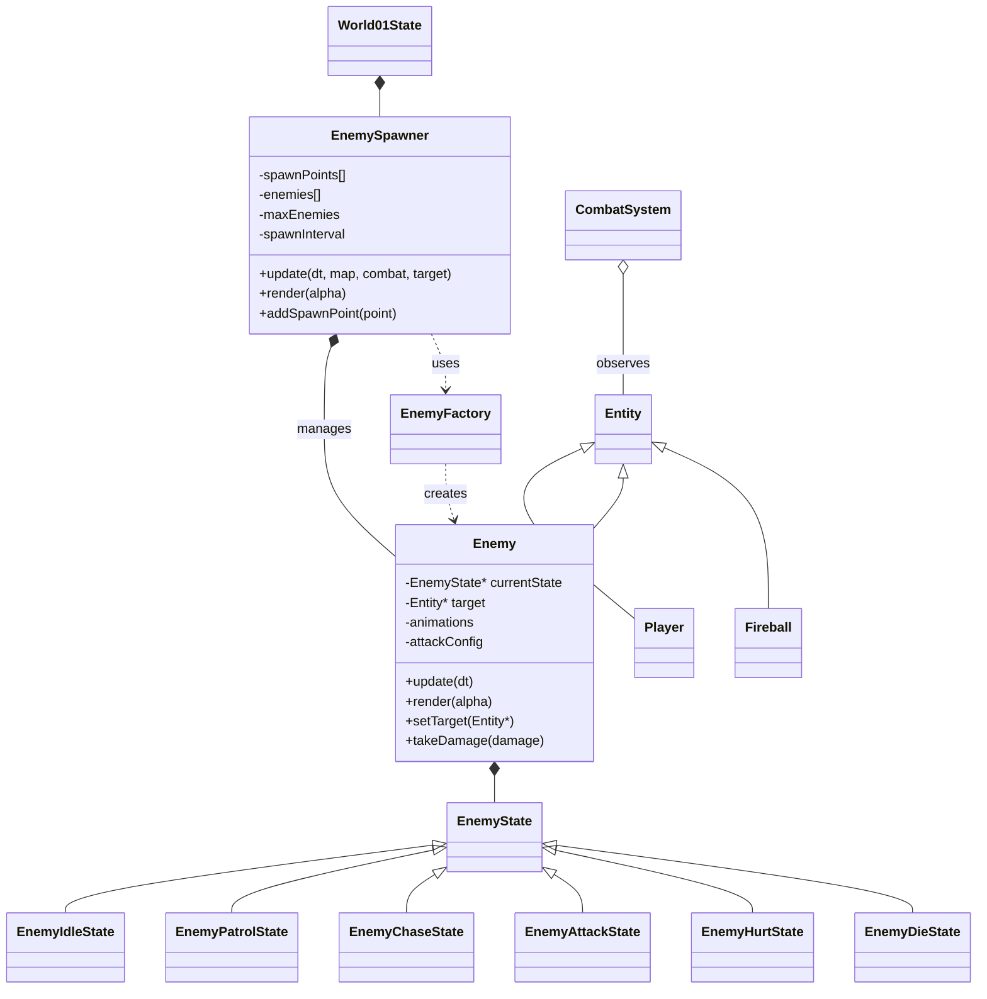

# Enemy Spawner & AI System

Build an **Enemy** entity class that mirrors the `Player` architecture (Entity → state machine → skills → combat) but replaces keyboard input with an **AI brain** that randomly decides to patrol, chase, or attack. Enemies are spawned by an **EnemySpawner** that can be placed in any World state.

## User Review Required

> [!IMPORTANT]
> **Enemy reuses the `Player` class directly vs. a new `Enemy` class?**
> The Player class is tightly coupled to keyboard input methods (`onMoveRight()`, `onMoveLeft()`, etc.) and `PlayerState` references. Creating a separate `Enemy` class that inherits from `Entity` with its own `EnemyState` hierarchy keeps things clean and avoids polluting the Player class. This plan uses **a new `Enemy` class**.

> [!WARNING]
> **Animation assets**: Enemies need sprite sheets. This plan reuses existing character sprites (e.g., Goku assets) for enemies. You can later add unique enemy sprites by adding entries to `characters.json`.

## Open Questions

1. **How many enemy types do you want initially?** This plan starts with one generic enemy type that can be configured via JSON to look/behave like any character. More types can be added later.
2. **Should enemies respawn after being killed?** This plan makes the spawner continuously spawn up to a max count. Killed enemies free a slot for new spawns.
3. **Should enemies fight each other or only target players?** This plan makes enemies target the nearest Player only (not other enemies).

---

## Proposed Changes

### Enemy Entity (Core — mirrors Player architecture)

This is the main new subsystem. The `Enemy` class mirrors `Player` with its own state machine, but the states are driven by AI logic instead of keyboard input.

#### [NEW] [Enemy.h](file:///d:/super_mario/Super_Mario_Plus/include/entity/Enemy/Enemy.h)

The `Enemy` class, extending `Entity`:
- Owns an `EnemyState` machine with states: `EnemyIdleState`, `EnemyPatrolState`, `EnemyChaseState`, `EnemyAttackState`, `EnemyHurtState`, `EnemyDieState`
- Stores a reference to a **target** (`Entity*`) for chase/attack logic
- Has the same `CharacterBaseStats`/`CharacterRuntimeStats`/`CharacterWorldStats` + animation system as `Player`
- Implements `hasActiveHitbox()`, `getActiveHitbox()`, `takeDamage()` for the existing `CombatSystem`
- Has helper methods: `moveRight()`, `moveLeft()`, `idle()`, `jump()`, `faceTarget()`, `distanceToTarget()`

#### [NEW] [EnemyState.h](file:///d:/super_mario/Super_Mario_Plus/include/entity/Enemy/EnemyState.h)

Base state class for enemy, similar to `PlayerState` but without input handlers — replaced by AI decision hooks:
- `update(float dt)` — AI logic runs here
- `onEnter()` / `onExit()` — state transitions

#### [NEW] [EnemyIdleState.h](file:///d:/super_mario/Super_Mario_Plus/include/entity/Enemy/EnemyIdleState.h) + `.cpp`

- Plays "idle" animation
- After a random delay (1–3s), randomly transitions to `PatrolState` or `ChaseState` (if target in range)

#### [NEW] [EnemyPatrolState.h](file:///d:/super_mario/Super_Mario_Plus/include/entity/Enemy/EnemyPatrolState.h) + `.cpp`

- Walks left/right within a patrol range
- Flips direction when hitting a wall (`onHitWall`) or reaching patrol boundary
- If a target comes within detection range, transitions to `ChaseState`
- After random patrol duration (2–5s), may transition back to `IdleState`

#### [NEW] [EnemyChaseState.h](file:///d:/super_mario/Super_Mario_Plus/include/entity/Enemy/EnemyChaseState.h) + `.cpp`

- Moves toward the target entity
- If target is within attack range, transitions to `AttackState`
- If target moves out of detection range, transitions back to `PatrolState`
- Can jump if the target is above (platform awareness)

#### [NEW] [EnemyAttackState.h](file:///d:/super_mario/Super_Mario_Plus/include/entity/Enemy/EnemyAttackState.h) + `.cpp`

- Plays attack animation, activates hitbox for a duration (like `PlayerSkillState`)
- Uses combat data from JSON config (attack power, hitbox size)
- After attack animation completes, transitions to `IdleState` or `ChaseState` randomly

#### [NEW] [EnemyHurtState.h](file:///d:/super_mario/Super_Mario_Plus/include/entity/Enemy/EnemyHurtState.h) + `.cpp`

- Plays "hurt" animation, brief invulnerability
- After animation, transitions back to `ChaseState` (aggressive) or `IdleState`

#### [NEW] [EnemyDieState.h](file:///d:/super_mario/Super_Mario_Plus/include/entity/Enemy/EnemyDieState.h) + `.cpp`

- Plays "die" animation
- After animation completes, marks entity as inactive (`isActive = false`), which the World cleanup loop already handles

#### [NEW] [Enemy.cpp](file:///d:/super_mario/Super_Mario_Plus/src/entity/Enemy/Enemy.cpp)

Implementation with:
- Constructor taking `CharacterBaseStats`, `CharacterRuntimeStats`, `CharacterWorldStats`, animations (same pattern as `Player`)
- `update(dt)`: delegates to current `EnemyState`
- `render(alpha)`: draws animated sprite (same rendering logic as Player)
- `setTarget(Entity*)`: lets the World assign which player to chase
- `takeDamage()`: transitions to hurt/die state
- Hook methods: `onLand()`, `onHitWall()`, `updateStateFromPhysics()`

#### [NEW] [EnemyState.cpp](file:///d:/super_mario/Super_Mario_Plus/src/entity/Enemy/EnemyState.cpp)

---

### Enemy Factory

#### [NEW] [EnemyFactory.h](file:///d:/super_mario/Super_Mario_Plus/include/entity/Enemy/EnemyFactory.h)

```cpp
class EnemyFactory {
public:
    static std::unique_ptr<Enemy> createEnemy(const std::string& charName, Vector2 pos);
};
```

Reads from `characters.json` (same format as Player), creates an `Enemy` with the correct stats, animations, and attack config.

#### [NEW] [EnemyFactory.cpp](file:///d:/super_mario/Super_Mario_Plus/src/entity/Enemy/EnemyFactory.cpp)

Mirrors `PlayerFactory::createPlayer()` but creates `Enemy` instances. Loads the same JSON config — this means you can make an enemy that uses "Goku" sprites and stats.

---

### Enemy Spawner

#### [NEW] [EnemySpawner.h](file:///d:/super_mario/Super_Mario_Plus/include/entity/Enemy/EnemySpawner.h)

```cpp
struct SpawnPoint {
    Vector2 position;
    std::string enemyType;  // character name in JSON (e.g., "Goku")
};

class EnemySpawner {
    std::vector<SpawnPoint> spawnPoints;
    std::vector<std::unique_ptr<Enemy>> enemies;
    int maxEnemies;
    float spawnInterval;     // seconds between spawn attempts
    float spawnTimer;
    
public:
    EnemySpawner(int maxEnemies = 3, float spawnInterval = 5.0f);
    void addSpawnPoint(const SpawnPoint& point);
    void update(float dt, const TileMap& map, CombatSystem& combat, Entity* target);
    void render(float alpha) const;
    std::vector<Enemy*> getActiveEnemies();
};
```

- Manages a pool of `Enemy` instances
- Periodically spawns enemies at random spawn points up to `maxEnemies`
- Updates all alive enemies (physics, AI, animation)
- Cleans up dead enemies automatically
- Registers new enemies with `CombatSystem`

#### [NEW] [EnemySpawner.cpp](file:///d:/super_mario/Super_Mario_Plus/src/entity/Enemy/EnemySpawner.cpp)

---

### JSON Config Extension

#### [MODIFY] [characters.json](file:///d:/super_mario/Super_Mario_Plus/assets/config/characters.json)

Add an `"enemy"` section to character configs to define AI parameters:

```json
"Goku": {
    // ... existing fields ...
    "enemy": {
        "detectionRange": 300.0,
        "attackRange": 70.0,
        "patrolRange": 200.0,
        "attackCooldown": 1.5,
        "attackSkill": "Punch1"
    }
}
```

This keeps everything data-driven — you can tune enemy behavior without recompiling.

---

### World State Integration

#### [MODIFY] [World01State.h](file:///d:/super_mario/Super_Mario_Plus/include/states/World01State.h)

Add `#include "EnemySpawner.h"` and a new member:
```cpp
EnemySpawner enemySpawner;
```

#### [MODIFY] [World01State.cpp](file:///d:/super_mario/Super_Mario_Plus/src/states/World01State.cpp)

- In constructor: add spawn points and configure the spawner
- In `Update(float dt)`: call `enemySpawner.update(dt, map, combatSystem, player1.get())`
- In `Render(float alpha)`: call `enemySpawner.render(alpha)`

Same changes apply to `World02State` if enemies are desired there.

---

### Build System

#### [MODIFY] [CMakeLists.txt](file:///d:/super_mario/Super_Mario_Plus/CMakeLists.txt)

Add new source files and include directory:
```cmake
include_directories(
    ...
    include/entity/Enemy
)

set(SOURCES
    ...
    src/entity/Enemy/Enemy.cpp
    src/entity/Enemy/EnemyState.cpp
    src/entity/Enemy/EnemyIdleState.cpp
    src/entity/Enemy/EnemyPatrolState.cpp
    src/entity/Enemy/EnemyChaseState.cpp
    src/entity/Enemy/EnemyAttackState.cpp
    src/entity/Enemy/EnemyHurtState.cpp
    src/entity/Enemy/EnemyDieState.cpp
    src/entity/Enemy/EnemyFactory.cpp
    src/entity/Enemy/EnemySpawner.cpp
)
```

---

## Architecture Diagram



## File Summary

| Category | File | Action |
|----------|------|--------|
| Enemy Core | `Enemy.h / .cpp` | NEW |
| Enemy States | `EnemyState.h / .cpp` | NEW |
| Enemy States | `EnemyIdleState.h / .cpp` | NEW |
| Enemy States | `EnemyPatrolState.h / .cpp` | NEW |
| Enemy States | `EnemyChaseState.h / .cpp` | NEW |
| Enemy States | `EnemyAttackState.h / .cpp` | NEW |
| Enemy States | `EnemyHurtState.h / .cpp` | NEW |
| Enemy States | `EnemyDieState.h / .cpp` | NEW |
| Factory | `EnemyFactory.h / .cpp` | NEW |
| Spawner | `EnemySpawner.h / .cpp` | NEW |
| Config | `characters.json` | MODIFY |
| World | `World01State.h / .cpp` | MODIFY |
| Build | `CMakeLists.txt` | MODIFY |

**Total: 20 new files, 4 modified files**

## Verification Plan

### Automated Tests
- Build the project with CMake to verify compilation: `cmake --build build`

### Manual Verification
- Run the game and enter World01
- Verify enemies spawn at designated positions after the spawn interval
- Verify enemies patrol (walk left/right) when no player is nearby
- Verify enemies chase the nearest player when in detection range
- Verify enemies attack when in attack range (hitbox appears, damage dealt)
- Verify enemies take damage from player attacks and show hurt/die states
- Verify dead enemies are cleaned up and new ones spawn to replace them
- Verify enemy count stays at or below `maxEnemies`
