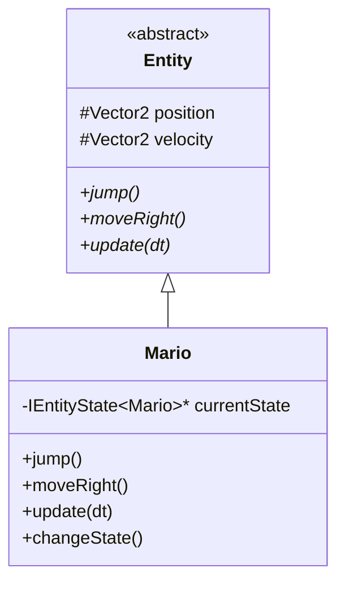
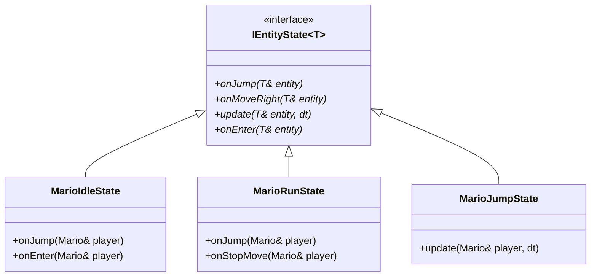
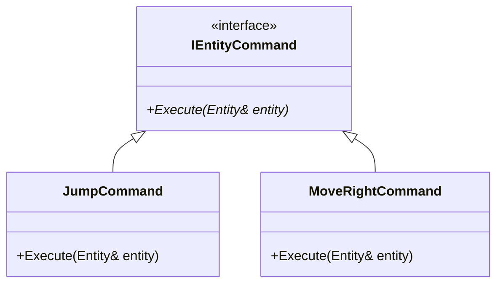
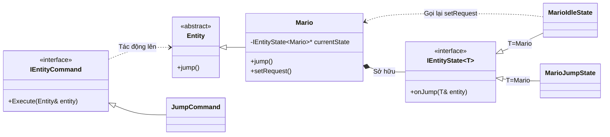
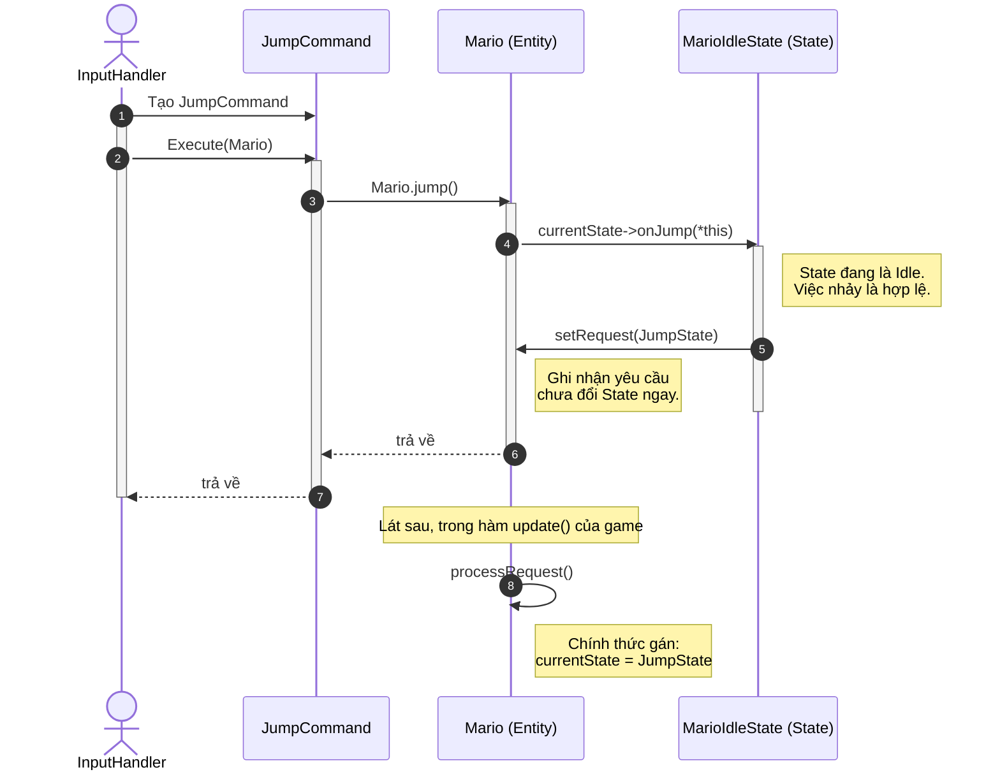

# Phân tích chi tiết Kiến trúc: Entity, State, Command

Tài liệu này bóc tách riêng rẽ cấu trúc kế thừa và cách hoạt động của từng thành phần, sau đó gộp chúng lại để thấy bức tranh toàn cảnh về cách hệ thống hoạt động.

---

## 1. Thành phần ENTITY (Thực thể)

### Sơ đồ Kế thừa
`Entity` là lớp cơ sở chứa các thuộc tính vật lý (tọa độ, vận tốc) và định nghĩa các hành động cơ bản (jump, move). `Mario` là một thực thể cụ thể kế thừa từ `Entity`.

### Cách hoạt động
**Mario** đóng vai trò là vỏ bọc (**Context**). Nó không tự dùng lệnh `if-else` dài dòng để xem "đang ở trên không thì có được nhảy không" hay "đang chạy thì ấn nhảy sẽ thế nào". Thay vào đó, Mario giữ một cái ruột là `currentState`, mỗi khi có lệnh (như `jump()`), Mario sẽ "ủy quyền" (delegate) lệnh đó cho `currentState` xử lý.

---

## 2. Thành phần STATE (Trạng thái)

### Sơ đồ Kế thừa
Tất cả các trạng thái đều tuân theo Interface `IEntityState`. Mỗi trạng thái cụ thể (Idle, Run, Jump) sẽ định nghĩa lại cách thực thể phản ứng với các hành động trong lúc đang ở trạng thái đó.

### Cách hoạt động
State là nơi chứa **logic điều kiện**. Ví dụ: 
- Khi gọi `onJump()` trong `MarioIdleState`, nó cho phép nhảy và yêu cầu Mario chuyển sang `JumpState`. 
- Nhưng trong `MarioJumpState`, hàm `onJump()` có thể không làm gì cả (tránh nhảy đúp).

---

## 3. Thành phần COMMAND (Mệnh lệnh)

### Sơ đồ Kế thừa
Các lệnh từ người chơi (hoặc AI) không được gọi thẳng vào `Mario` mà được đóng gói thành các object `Command` độc lập.

### Cách hoạt động
`InputHandler` sẽ đọc phím bấm và trả về một `Command` tương ứng. 
Lệnh này chỉ có một nhiệm vụ duy nhất: Khi hàm `Execute()` của nó được gọi, nó sẽ gọi đúng hàm tương ứng trên `Entity` truyền vào. (Ví dụ: `JumpCommand` thì gọi `entity.jump()`). Nó không cần biết `Entity` đó là Mario hay Goomba.

---

## 4. GỘP CHUNG: Mối liên hệ và Luồng hoạt động

Khi gộp 3 hệ thống này lại, ta có một kiến trúc rất lỏng lẻo (decoupled) nhưng hoạt động ăn ý theo luồng:
**Người chơi Input -> Tạo Command -> Execute trên Entity -> Entity ủy quyền cho State -> State ra lệnh Entity chuyển trạng thái**.

### Sơ đồ Lớp Tổng Hợp (Mermaid)
Bức tranh toàn cảnh thể hiện sự "lỏng lẻo" trong thiết kế: Mọi thứ liên kết với nhau qua các giao diện (Interfaces).

### Sơ đồ Luồng Tương tác Tổng Hợp (Mermaid)
Sơ đồ mô phỏng vòng lặp chuẩn khi người chơi nhấn nút Nhảy lúc đang đứng yên. Bạn có thể thấy rõ dòng đời của một lệnh truyền từ Input vào tận sâu bên trong State như thế nào.

